# NexusD Architecture

## Overview

NexusD is a **brokerless, distributed publish/subscribe middleware** implementing the **sidecar pattern**. Each application instance runs alongside its own NexusD daemon, forming a peer-to-peer mesh network. This document provides a comprehensive technical deep-dive into NexusD's internal architecture, design decisions, data flows, and implementation details.

**Target Audience:** Developers, architects, and operators who need to understand how NexusD works internally for debugging, extending, or operating production deployments.

## Core Design Principles

1. **Brokerless Mesh**: No central coordinator; every node is equal. Fault tolerance through peer redundancy.
2. **Lazy Synchronization**: Hash-triggered gossip protocol minimizes network chatter. Nodes only sync when state diverges.
3. **Async-First**: gRPC async callback API (Reactors) throughout - no blocking operations in critical paths.
4. **Modular Libraries**: Split into independent shared libraries (`nexusd_utils`, `nexusd_net`, `nexusd_proto`, `nexusd_core`, `nexusd_services`) for easier patching, testing, and deployment.
5. **Zero-Copy Where Possible**: Uses `std::string_view`, move semantics, and gRPC arena allocations to minimize memory copies.
6. **Thread-Safe by Design**: All shared state protected by `std::shared_mutex` (readers-writer locks) or `std::mutex`.

## Component Diagram

The following diagram shows the complete NexusD architecture with all components and their relationships:

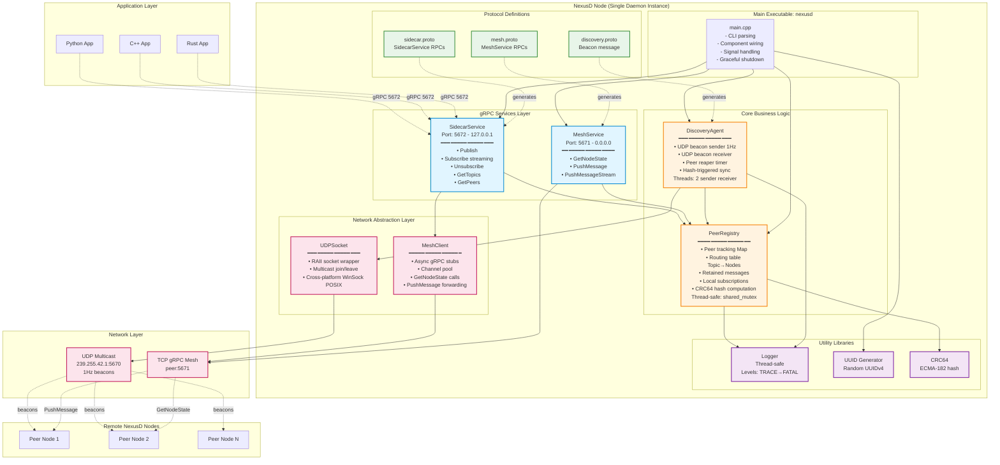
```mermaid
graph TB
    subgraph "Application Layer"
        APP1[Python App]
        APP2[C++ App]
        APP3[Rust App]
    end
    
    subgraph "NexusD Node (Single Daemon Instance)"
        subgraph "Main Executable: nexusd"
            MAIN[main.cpp<br/>- CLI parsing<br/>- Component wiring<br/>- Signal handling<br/>- Graceful shutdown]
        end
        
        subgraph "gRPC Services Layer"
            SIDECAR[SidecarService<br/>Port: 5672 - 127.0.0.1<br/>━━━━━━━━━━━━━━━━<br/>• Publish<br/>• Subscribe streaming<br/>• Unsubscribe<br/>• GetTopics<br/>• GetPeers]
            
            MESH[MeshService<br/>Port: 5671 - 0.0.0.0<br/>━━━━━━━━━━━━━━━━<br/>• GetNodeState<br/>• PushMessage<br/>• PushMessageStream]
        end
        
        subgraph "Core Business Logic"
            REGISTRY[PeerRegistry<br/>━━━━━━━━━━━━━━━━<br/>• Peer tracking Map<br/>• Routing table Topic→Nodes<br/>• Retained messages<br/>• Local subscriptions<br/>• CRC64 hash computation<br/>Thread-safe: shared_mutex]
            
            DISCOVERY[DiscoveryAgent<br/>━━━━━━━━━━━━━━━━<br/>• UDP beacon sender 1Hz<br/>• UDP beacon receiver<br/>• Peer reaper timer<br/>• Hash-triggered sync<br/>Threads: 2 sender receiver]
        end
        
        subgraph "Network Abstraction Layer"
            UDP[UDPSocket<br/>━━━━━━━━━━━━━━━━<br/>• RAII socket wrapper<br/>• Multicast join/leave<br/>• Cross-platform WinSock POSIX]
            
            MESHCLIENT[MeshClient<br/>━━━━━━━━━━━━━━━━<br/>• Async gRPC stubs<br/>• Channel pool<br/>• GetNodeState calls<br/>• PushMessage forwarding]
        end
        
        subgraph "Utility Libraries"
            LOGGER[Logger<br/>Thread-safe<br/>Levels: TRACE→FATAL]
            UUID[UUID Generator<br/>Random UUIDv4]
            CRC[CRC64<br/>ECMA-182 hash]
        end
        
        subgraph "Protocol Definitions"
            PROTO1[discovery.proto<br/>Beacon message]
            PROTO2[mesh.proto<br/>MeshService RPCs]
            PROTO3[sidecar.proto<br/>SidecarService RPCs]
        end
    end
    
    subgraph "Network Layer"
        MCAST[UDP Multicast<br/>239.255.42.1:5670<br/>1Hz beacons]
        TCP[TCP gRPC Mesh<br/>peer:5671]
    end
    
    subgraph "Remote NexusD Nodes"
        PEER1[Peer Node 1]
        PEER2[Peer Node 2]
        PEER3[Peer Node N]
    end
    
    %% Application connections
    APP1 -.gRPC 5672.-> SIDECAR
    APP2 -.gRPC 5672.-> SIDECAR
    APP3 -.gRPC 5672.-> SIDECAR
    
    %% Service to core
    SIDECAR --> REGISTRY
    MESH --> REGISTRY
    SIDECAR --> MESHCLIENT
    
    %% Core interactions
    DISCOVERY --> REGISTRY
    DISCOVERY --> UDP
    MESHCLIENT --> TCP
    
    %% Discovery flow
    UDP --> MCAST
    MCAST -.beacons.-> PEER1
    MCAST -.beacons.-> PEER2
    MCAST -.beacons.-> PEER3
    
    %% Mesh communication
    MESH --> TCP
    TCP -.PushMessage.-> PEER1
    TCP -.GetNodeState.-> PEER2
    
    %% Main wiring
    MAIN --> SIDECAR
    MAIN --> MESH
    MAIN --> DISCOVERY
    MAIN --> REGISTRY
    
    %% Utils usage
    REGISTRY --> CRC
    REGISTRY --> LOGGER
    DISCOVERY --> LOGGER
    MAIN --> UUID
    
    %% Proto compilation
    PROTO1 -.generates.-> DISCOVERY
    PROTO2 -.generates.-> MESH
    PROTO3 -.generates.-> SIDECAR

    classDef service fill:#e1f5ff,stroke:#0288d1,stroke-width:2px
    classDef core fill:#fff3e0,stroke:#f57c00,stroke-width:2px
    classDef util fill:#f3e5f5,stroke:#7b1fa2,stroke-width:2px
    classDef proto fill:#e8f5e9,stroke:#388e3c,stroke-width:2px
    classDef network fill:#fce4ec,stroke:#c2185b,stroke-width:2px
    
    class SIDECAR,MESH service
    class REGISTRY,DISCOVERY core
    class LOGGER,UUID,CRC util
    class PROTO1,PROTO2,PROTO3 proto
    class UDP,MESHCLIENT,MCAST,TCP network
```

**Diagram Explanation:**

This comprehensive component diagram illustrates the complete NexusD daemon architecture:

- **Application Layer**: Multiple language clients (Python, C++, Rust) connect to the same local daemon via gRPC on port 5672 (localhost only for security).

- **gRPC Services**: Two distinct gRPC servers:
  - `SidecarService` (port 5672, localhost): Application-facing API for Publish/Subscribe operations
  - `MeshService` (port 5671, all interfaces): Peer-to-peer communication for state sync and message forwarding

- **Core Logic**: 
  - `PeerRegistry`: Central state store managing peers, routing table (topic → subscriber nodes), retained messages, and local subscriptions. Protected by `std::shared_mutex` for concurrent reads.
  - `DiscoveryAgent`: Manages UDP multicast beacons (1Hz transmission) and peer liveness tracking.

- **Network Layer**:
  - `UDPSocket`: Cross-platform abstraction over WinSock/POSIX for multicast group management
  - `MeshClient`: Async gRPC client pool for calling remote `MeshService` endpoints

- **Utilities**: Shared libraries providing logging, UUID generation, and CRC64 hashing

- **Protocol Buffers**: Three `.proto` files defining wire formats for discovery beacons, mesh RPCs, and sidecar RPCs

## Library Structure

NexusD is decomposed into six shared libraries plus one main executable, enabling modular compilation, testing, and deployment.

### Library Dependency Graph

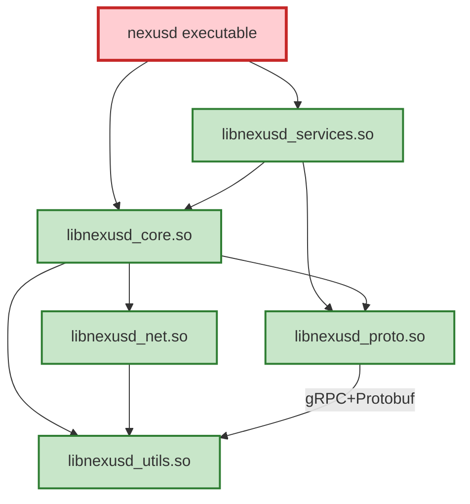
```mermaid
graph TD
    NEXUSD[nexusd executable]
    SERVICES[libnexusd_services.so]
    CORE[libnexusd_core.so]
    PROTO[libnexusd_proto.so]
    NET[libnexusd_net.so]
    UTILS[libnexusd_utils.so]
    
    NEXUSD --> SERVICES
    NEXUSD --> CORE
    SERVICES --> CORE
    SERVICES --> PROTO
    CORE --> PROTO
    CORE --> NET
    CORE --> UTILS
    NET --> UTILS
    PROTO --> |gRPC+Protobuf| UTILS
    
    classDef exe fill:#ffcdd2,stroke:#c62828,stroke-width:3px
    classDef lib fill:#c8e6c9,stroke:#2e7d32,stroke-width:2px
    
    class NEXUSD exe
    class SERVICES,CORE,PROTO,NET,UTILS lib
```

**Dependency Explanation:**

- **Bottom Layer**: `nexusd_utils` has zero external dependencies (only C++ STL). Provides foundational utilities.
- **Network Layer**: `nexusd_net` depends only on `nexusd_utils` for logging. Wraps platform-specific socket APIs.
- **Protocol Layer**: `nexusd_proto` contains generated code from `.proto` files. Depends on gRPC/Protobuf libraries.
- **Core Logic**: `nexusd_core` orchestrates discovery and peer management. Depends on net, proto, and utils.
- **Service Layer**: `nexusd_services` implements gRPC service handlers. Depends on core and proto.
- **Executable**: `nexusd` is a thin main() that wires components together.

### nexusd_utils

**Purpose**: Base utilities with no external dependencies (except C++ STL).

| Component | Header | Description | Key Methods |
|-----------|--------|-------------|-------------|
| `Logger` | `utils/logger.hpp` | Thread-safe singleton logger with configurable levels | `LOG_TRACE()`, `LOG_DEBUG()`, `LOG_INFO()`, `LOG_WARN()`, `LOG_ERROR()`, `LOG_FATAL()`<br/>Levels: TRACE, DEBUG, INFO, WARN, ERROR, FATAL |
| `generateUUID()` | `utils/uuid.hpp` | Random UUID v4 generation using STL random | Returns RFC 4122 compliant UUID string (e.g., "550e8400-e29b-41d4-a716-446655440000") |
| `crc64()` | `utils/crc64.hpp` | ECMA-182 CRC64 for topic state hashing | `uint64_t crc64(const std::string& data)` - Deterministic hash for change detection |

**Threading**: Logger uses `std::mutex` for output serialization. All functions are thread-safe.

**Testing**: Unit tests in `tests/unit/test_utils.cpp`

### nexusd_net

**Purpose**: Cross-platform network abstraction for UDP multicast.

| Component | Header | Description | Key Methods |
|-----------|--------|-------------|-------------|
| `UDPSocket` | `net/udp_socket.hpp` | RAII UDP socket with multicast support | `create()` - Initialize socket<br/>`bind(port)` - Bind to local port<br/>`joinMulticastGroup(addr)` - Join multicast group<br/>`sendTo(data, addr, port)` - Send datagram<br/>`receiveFrom(buffer)` - Blocking receive<br/>`setReuseAddress()`, `setMulticastTTL()`, `setMulticastLoopback()` |
| Platform Headers | `net/platform.hpp` | Conditional includes for WinSock2 vs POSIX sockets | Auto-detects `_WIN32` and includes appropriate headers |

**Platform Support**:
- **Windows**: WinSock2 (`ws2_32.lib`, `iphlpapi.lib`)
- **Linux/macOS**: POSIX sockets (`<sys/socket.h>`, `<netinet/in.h>`, `<arpa/inet.h>`)

**Error Handling**: Returns `bool` success/failure. Logs errors internally via `Logger`.

**RAII**: Socket automatically closed in destructor. Copy constructor deleted (move-only).

### nexusd_proto

**Purpose**: Generated protobuf and gRPC code from `.proto` definitions.

| Proto File | Package | Purpose | Key Messages/Services |
|------------|---------|---------|----------------------|
| `discovery.proto` | `nexusd.discovery` | UDP beacon message for multicast discovery | `Beacon` message with fields:<br/>• `instance_uuid` (string)<br/>• `cluster_id` (string)<br/>• `rpc_ip` (string)<br/>• `rpc_port` (int32)<br/>• `topic_state_hash` (uint64)<br/>• `timestamp_ms` (int64)<br/>• `protocol_version` (int32) |
| `mesh.proto` | `nexusd.mesh` | Node-to-node RPC definitions | `MeshService` with RPCs:<br/>• `GetNodeState()` → `NodeState`<br/>• `PushMessage(MessageEnvelope)` → `Ack`<br/>• `PushMessageStream()` → bidirectional stream<br/><br/>Messages: `NodeState`, `MessageEnvelope`, `Ack` |
| `sidecar.proto` | `nexusd.sidecar` | App-to-sidecar RPC definitions | `SidecarService` with RPCs:<br/>• `Publish(PublishRequest)` → `PublishResponse`<br/>• `Subscribe(SubscribeRequest)` → stream `MessageEvent`<br/>• `Unsubscribe(UnsubscribeRequest)` → `UnsubscribeResponse`<br/>• `GetTopics()`, `GetPeers()` for monitoring |

**Code Generation**: CMake uses `protoc` + gRPC plugin to generate `.pb.h`, `.pb.cc`, `.grpc.pb.h`, `.grpc.pb.cc`

**Arena Allocation**: Enabled via `option cc_enable_arenas = true` for reduced allocations in high-throughput scenarios.

### nexusd_core

**Purpose**: Core business logic for peer management and discovery.

| Component | Header | Description | Key Data Structures | Key Methods |
|-----------|--------|-------------|---------------------|-------------|
| `PeerRegistry` | `core/peer_registry.hpp` | Thread-safe registry of peers, routing table, retained messages | • `std::unordered_map<string, shared_ptr<PeerInfo>> peers_`<br/>• `std::unordered_map<string, unordered_set<string>> routingTable_` (topic → node IDs)<br/>• `std::unordered_map<string, RetainedMessage> retainedMessages_`<br/>• `std::unordered_map<string, unordered_set<string>> localSubscriptions_` (subscription_id → topics)<br/>• `std::shared_mutex peerMutex_`, `retainedMutex_`, `subscriptionMutex_` | `upsertPeer(PeerInfo)` → bool (returns true if sync needed)<br/>`removePeer(uuid)`<br/>`getPeer(uuid)` → shared_ptr<PeerInfo><br/>`addLocalSubscription(id, topics)`<br/>`removeLocalSubscription(id)`<br/>`getLocalTopicHash()` → uint64<br/>`storeRetainedMessage(topic, msg)`<br/>`rebuildRoutingTable()` |
| `DiscoveryAgent` | `core/discovery_agent.hpp` | UDP multicast beacon sender/receiver, peer reaper | • `UDPSocket socket_`<br/>• `std::thread senderThread_`, `receiverThread_`<br/>• `std::atomic<bool> running_`<br/>• `SyncPeerCallback syncCallback_` (function<void(string endpoint)>) | `start()` → bool<br/>`stop()`<br/>`setSyncCallback(callback)`<br/>`senderLoop()` - Sends beacons at 1Hz<br/>`receiverLoop()` - Receives beacons, calls `upsertPeer()`<br/>`reaperLoop()` - Removes stale peers every 1s |

**PeerInfo Structure**:
```cpp
struct PeerInfo {
    string instance_uuid;
    string cluster_id;
    string rpc_ip;
    int32_t rpc_port;
    uint64_t topic_state_hash;
    PeerStatus status;  // ALIVE, SUSPECTED, DEAD
    chrono::steady_clock::time_point last_seen;
    bool synced;
    
    string endpoint() const { return rpc_ip + ":" + to_string(rpc_port); }
};
```

**Hash Computation**: 
1. Collect all local topics into `std::vector<string>`
2. Sort lexicographically: `std::sort(topics.begin(), topics.end())`
3. Concatenate: `std::string data = topic1 + topic2 + ...`
4. Compute CRC64: `uint64_t hash = crc64(data)`

**Stale Peer Detection**: Peer removed if `now - last_seen > 5 seconds`

### nexusd_services

**Purpose**: gRPC service implementations (async callback-based Reactors).

| Component | Header | Description | gRPC Reactor Classes | Key Methods |
|-----------|--------|-------------|----------------------|-------------|
| `MeshServiceImpl` | `services/mesh_service.hpp` | Inter-node mesh communication | `GetNodeStateReactor` (unary)<br/>`PushMessageReactor` (unary)<br/>`PushMessageStreamReactor` (bidi) | `GetNodeState()` → Returns `NodeState` with topics + retained messages<br/>`PushMessage()` → Forwards message to local subscribers<br/>`PushMessageStream()` → Bidirectional streaming for bulk transfers |
| `SidecarServiceImpl` | `services/sidecar_service.hpp` | Application-facing pub/sub API | `PublishReactor` (unary)<br/>`SubscribeReactor` (server-streaming)<br/>`UnsubscribeReactor` (unary)<br/>`GetTopicsReactor`, `GetPeersReactor` (unary) | `Publish()` → Routes message to local + remote subscribers<br/>`Subscribe()` → Opens streaming RPC, sends retained messages first<br/>`Unsubscribe()` → Closes subscription by ID<br/>`GetTopics()`, `GetPeers()` → Monitoring APIs |
| `MeshClient` | `services/mesh_client.hpp` | Async gRPC client for calling remote `MeshService` | N/A (client-side) | `getNodeState(endpoint, callback)`<br/>`pushMessage(endpoint, envelope, callback)`<br/>`getStub(endpoint)` → Returns cached gRPC stub with keepalive |

**gRPC Reactor Pattern**:
- All RPCs use async callbacks (no blocking in gRPC threads)
- Each RPC creates a Reactor object that handles:
  1. Request processing
  2. Response generation
  3. Asynchronous completion via `Finish()` or `StartWrite()`
  4. Self-deletion via `delete this` in `OnDone()`

**Subscription Management**:
- `SubscribeReactor` holds a `SubscriptionStream` struct with:
  - `subscription_id` (UUID)
  - `topics` (vector of subscribed topics)
  - `reactor` (pointer to gRPC ServerWriteReactor)
  - `active` (atomic bool for cancellation)
  - `writeMutex` + `pendingMessages` queue for flow control
- Messages delivered via `reactor->StartWrite()` when safe (not already writing)

## Data Flow

This section details the complete lifecycle of messages and state synchronization through the NexusD mesh.

### Publishing a Message - Complete Flow

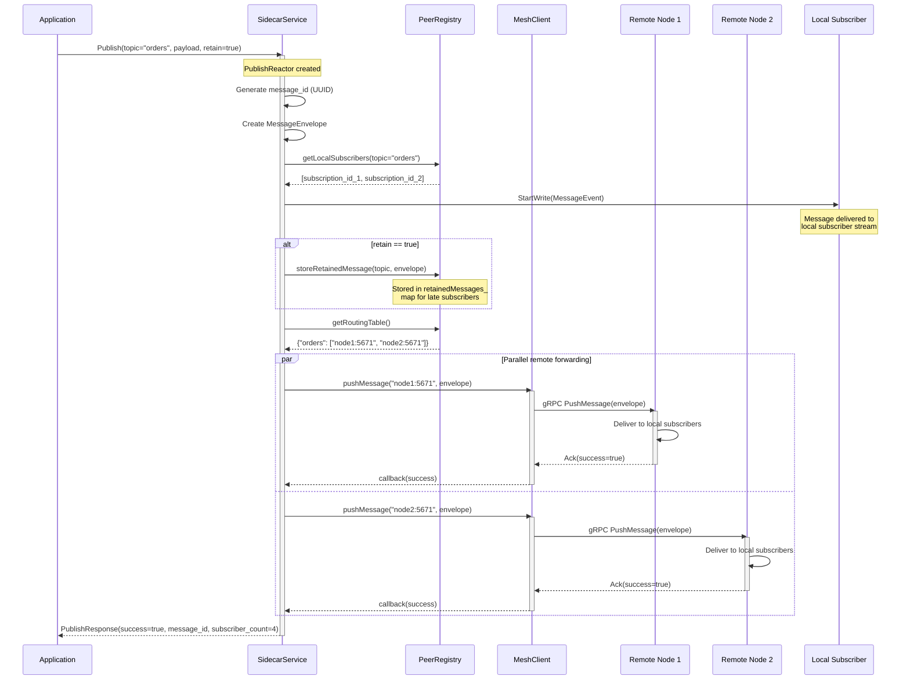
```mermaid
sequenceDiagram
    participant App as Application
    participant SC as SidecarService
    participant PR as PeerRegistry
    participant MC as MeshClient
    participant RS1 as Remote Node 1
    participant RS2 as Remote Node 2
    participant LS as Local Subscriber
    
    App->>SC: Publish(topic="orders", payload, retain=true)
    activate SC
    
    Note over SC: PublishReactor created
    SC->>SC: Generate message_id (UUID)
    SC->>SC: Create MessageEnvelope
    
    %% Local delivery
    SC->>PR: getLocalSubscribers(topic="orders")
    PR-->>SC: [subscription_id_1, subscription_id_2]
    
    SC->>LS: StartWrite(MessageEvent)
    Note over LS: Message delivered to<br/>local subscriber stream
    
    %% Store retained
    alt retain == true
        SC->>PR: storeRetainedMessage(topic, envelope)
        Note over PR: Stored in retainedMessages_<br/>map for late subscribers
    end
    
    %% Remote delivery
    SC->>PR: getRoutingTable()
    PR-->>SC: {"orders": ["node1:5671", "node2:5671"]}
    
    par Parallel remote forwarding
        SC->>MC: pushMessage("node1:5671", envelope)
        activate MC
        MC->>RS1: gRPC PushMessage(envelope)
        activate RS1
        RS1->>RS1: Deliver to local subscribers
        RS1-->>MC: Ack(success=true)
        deactivate RS1
        MC-->>SC: callback(success)
        deactivate MC
    and
        SC->>MC: pushMessage("node2:5671", envelope)
        activate MC
        MC->>RS2: gRPC PushMessage(envelope)
        activate RS2
        RS2->>RS2: Deliver to local subscribers
        RS2-->>MC: Ack(success=true)
        deactivate RS2
        MC-->>SC: callback(success)
        deactivate MC
    end
    
    SC-->>App: PublishResponse(success=true, message_id, subscriber_count=4)
    deactivate SC
```

**Flow Explanation:**

1. **Request Initiation**: Application calls `Publish()` on local SidecarService (gRPC unary call)

2. **Reactor Creation**: `PublishReactor` is instantiated to handle the request asynchronously

3. **Message ID Generation**: UUID v4 generated for message deduplication and tracing

4. **Local Delivery (Immediate)**:
   - Query `PeerRegistry` for local subscriptions matching the topic
   - For each active subscription, enqueue message in `SubscriptionStream.pendingMessages`
   - Trigger `StartWrite()` on the subscriber's `ServerWriteReactor` to stream the message

5. **Retained Message Storage (Conditional)**:
   - If `retain == true`, store message in `retainedMessages_` map (one per topic)
   - Overwrites previous retained message for same topic
   - Will be sent to future subscribers immediately upon `Subscribe()`

6. **Remote Delivery (Parallel)**:
   - Query routing table to find remote nodes subscribed to this topic
   - For each remote node, asynchronously call `MeshClient.pushMessage()`
   - `MeshClient` maintains a pool of gRPC stubs with keepalive connections
   - Remote node's `MeshService.PushMessage()` delivers to its local subscribers

7. **Response**: Return `PublishResponse` with total subscriber count (local + remote)

**Performance Notes**:
- Local delivery is synchronous (message immediately available to local subscribers)
- Remote delivery is async (fire-and-forget with callback for error logging)
- No waiting for remote ACKs before responding to publisher
- Typical latency: <1ms for local, 1-5ms for remote (within same datacenter)

### Subscribing to a Topic - Complete Flow

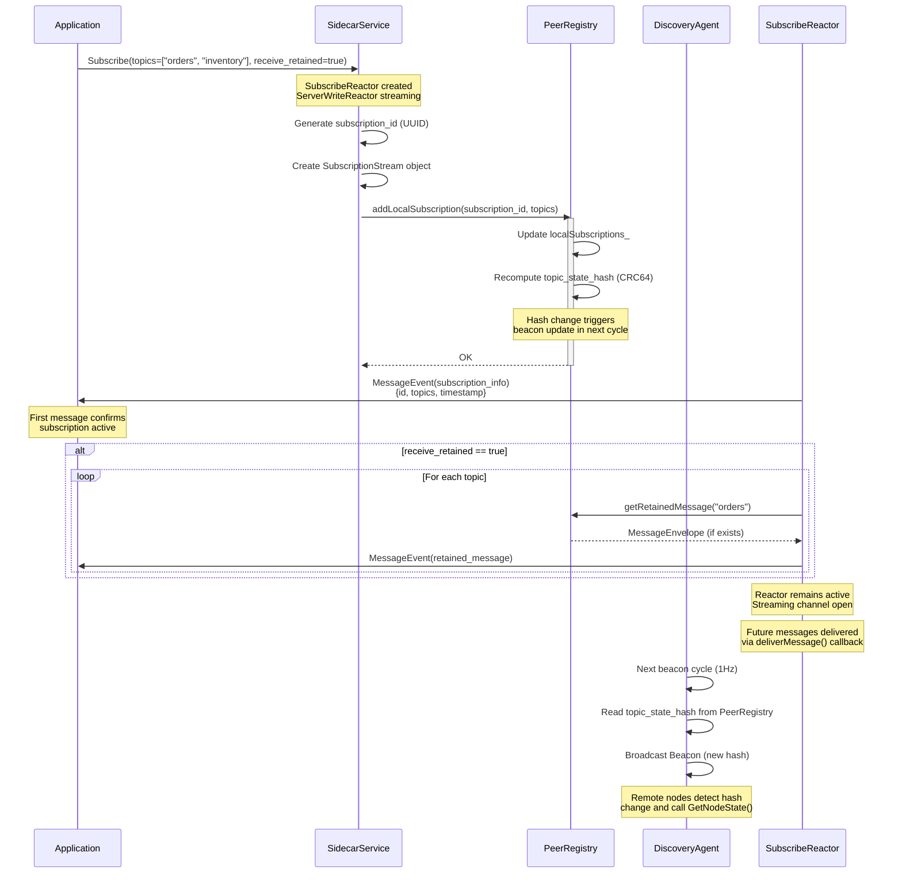
```mermaid
sequenceDiagram
    participant App as Application
    participant SC as SidecarService
    participant PR as PeerRegistry
    participant DA as DiscoveryAgent
    participant Reactor as SubscribeReactor
    
    App->>SC: Subscribe(topics=["orders", "inventory"], receive_retained=true)
    activate SC
    
    Note over SC: SubscribeReactor created<br/>ServerWriteReactor streaming
    SC->>SC: Generate subscription_id (UUID)
    SC->>SC: Create SubscriptionStream object
    
    SC->>PR: addLocalSubscription(subscription_id, topics)
    activate PR
    PR->>PR: Update localSubscriptions_
    PR->>PR: Recompute topic_state_hash (CRC64)
    Note over PR: Hash change triggers<br/>beacon update in next cycle
    PR-->>SC: OK
    deactivate PR
    
    %% Send subscription info
    Reactor->>App: MessageEvent(subscription_info)<br/>{id, topics, timestamp}
    Note over App: First message confirms<br/>subscription active
    
    %% Deliver retained messages
    alt receive_retained == true
        loop For each topic
            Reactor->>PR: getRetainedMessage("orders")
            PR-->>Reactor: MessageEnvelope (if exists)
            Reactor->>App: MessageEvent(retained_message)
        end
    end
    
    Note over Reactor: Reactor remains active<br/>Streaming channel open
    Note over Reactor: Future messages delivered<br/>via deliverMessage() callback
    
    %% Discovery propagation
    DA->>DA: Next beacon cycle (1Hz)
    DA->>DA: Read topic_state_hash from PeerRegistry
    DA->>DA: Broadcast Beacon (new hash)
    Note over DA: Remote nodes detect hash<br/>change and call GetNodeState()
```

**Flow Explanation:**

1. **Subscribe Request**: Application calls `Subscribe()` with list of topics and options

2. **Reactor Creation**: 
   - `SubscribeReactor` created (server-streaming RPC)
   - UUID generated for `subscription_id` (returned to client for later unsubscribe)
   - `SubscriptionStream` object allocated to hold stream state

3. **Registry Update**:
   - Add subscription to `localSubscriptions_` map
   - Recompute `topic_state_hash` (CRC64 of sorted topic list)
   - Hash change will be detected in next discovery beacon cycle

4. **Subscription Confirmation**:
   - First message sent to app: `MessageEvent.subscription_info` containing subscription_id and topics
   - Client must store subscription_id for later `Unsubscribe()` call

5. **Retained Message Delivery** (if requested):
   - Query `retainedMessages_` for each subscribed topic
   - If retained message exists, send immediately as `MessageEvent.retained_message`
   - Guarantees late subscribers receive last-known state

6. **Stream Kept Open**:
   - Reactor remains active (not deleted)
   - Future messages delivered via `deliverMessage(subscription_id, envelope)` callback
   - Flow control: Messages queued if `writing_ == true`, delivered when safe

7. **Discovery Propagation** (async):
   - Next `DiscoveryAgent.senderLoop()` cycle (1Hz) broadcasts new hash
   - Remote nodes detect mismatch → call `GetNodeState()` → update routing tables
   - Convergence time: ~1-2 seconds (1 beacon + 1 RPC)

### Discovery and Sync - Hash-Triggered Gossip

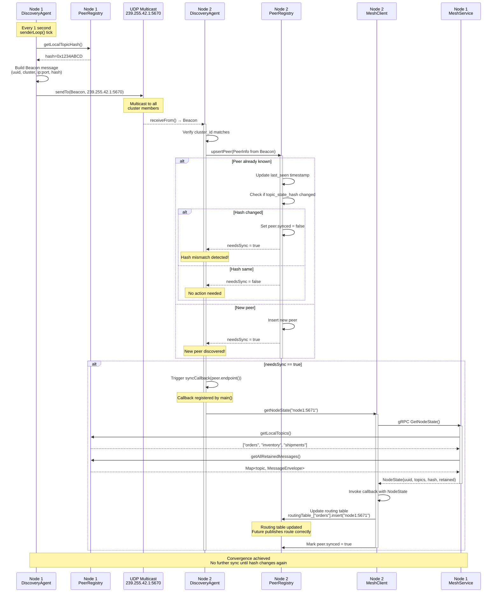
```mermaid
sequenceDiagram
    participant DA1 as Node 1<br/>DiscoveryAgent
    participant PR1 as Node 1<br/>PeerRegistry
    participant UDP as UDP Multicast<br/>239.255.42.1:5670
    participant DA2 as Node 2<br/>DiscoveryAgent
    participant PR2 as Node 2<br/>PeerRegistry
    participant MC2 as Node 2<br/>MeshClient
    participant MS1 as Node 1<br/>MeshService
    
    Note over DA1: Every 1 second<br/>senderLoop() tick
    DA1->>PR1: getLocalTopicHash()
    PR1-->>DA1: hash=0x1234ABCD
    
    DA1->>DA1: Build Beacon message<br/>(uuid, cluster, ip:port, hash)
    DA1->>UDP: sendTo(Beacon, 239.255.42.1:5670)
    Note over UDP: Multicast to all<br/>cluster members
    
    UDP-->>DA2: receiveFrom() → Beacon
    activate DA2
    
    DA2->>DA2: Verify cluster_id matches
    DA2->>PR2: upsertPeer(PeerInfo from Beacon)
    activate PR2
    
    alt Peer already known
        PR2->>PR2: Update last_seen timestamp
        PR2->>PR2: Check if topic_state_hash changed
        
        alt Hash changed
            PR2->>PR2: Set peer.synced = false
            PR2-->>DA2: needsSync = true
            Note over DA2: Hash mismatch detected!
        else Hash same
            PR2-->>DA2: needsSync = false
            Note over DA2: No action needed
        end
    else New peer
        PR2->>PR2: Insert new peer
        PR2-->>DA2: needsSync = true
        Note over DA2: New peer discovered!
    end
    deactivate PR2
    
    alt needsSync == true
        DA2->>DA2: Trigger syncCallback(peer.endpoint())
        Note over DA2: Callback registered by main()
        
        DA2->>MC2: getNodeState("node1:5671")
        activate MC2
        MC2->>MS1: gRPC GetNodeState()
        activate MS1
        
        MS1->>PR1: getLocalTopics()
        PR1-->>MS1: ["orders", "inventory", "shipments"]
        
        MS1->>PR1: getAllRetainedMessages()
        PR1-->>MS1: Map<topic, MessageEnvelope>
        
        MS1-->>MC2: NodeState(uuid, topics, hash, retained)
        deactivate MS1
        
        MC2->>MC2: Invoke callback with NodeState
        MC2->>PR2: Update routing table<br/>routingTable_["orders"].insert("node1:5671")
        Note over PR2: Routing table updated<br/>Future publishes route correctly
        MC2->>PR2: Mark peer.synced = true
        
        deactivate MC2
    end
    
    deactivate DA2
    
    Note over DA1,MS1: Convergence achieved<br/>No further sync until hash changes again
```

**Flow Explanation:**

1. **Beacon Transmission (1Hz)**:
   - Every node broadcasts a `Beacon` message via UDP multicast at 1-second intervals
   - Beacon contains: instance_uuid, cluster_id, rpc_ip, rpc_port, topic_state_hash, timestamp

2. **Beacon Reception**:
   - `DiscoveryAgent.receiverLoop()` blocks on `UDPSocket.receiveFrom()`
   - Deserializes protobuf `Beacon` message from UDP payload

3. **Cluster Verification**:
   - Check if `beacon.cluster_id == config.cluster_id`
   - If mismatch → ignore (enables multiple isolated clusters on same LAN)

4. **Peer Upsert**:
   - Call `PeerRegistry.upsertPeer()` with beacon data
   - If new peer: Insert into `peers_` map, return `needsSync = true`
   - If existing peer:
     - Update `last_seen` timestamp (prevents reaper from removing)
     - Compare `topic_state_hash` with stored hash
     - If hash differs → set `synced = false`, return `needsSync = true`

5. **Hash-Triggered Sync** (lazy synchronization):
   - Only when `needsSync == true`, trigger `syncCallback(endpoint)`
   - Callback invokes `MeshClient.getNodeState(endpoint)`
   - Async gRPC call to remote `MeshService.GetNodeState()`

6. **State Transfer**:
   - Remote node returns `NodeState` message containing:
     - Full list of subscribed topics
     - Current topic_state_hash (for verification)
     - All retained messages
   - Local node updates routing table: For each topic, add remote node to subscriber set

7. **Convergence**:
   - Mark peer as `synced = true`
   - No further sync calls until hash changes again (new subscribe/unsubscribe)

**Key Optimizations**:
- **Lazy Sync**: Only transfer full state when hash diverges (not on every beacon)
- **Multicast Efficiency**: Single UDP packet reaches all peers simultaneously
- **Async RPC**: GetNodeState() doesn't block discovery thread
- **Idempotency**: Multiple sync calls safe (routing table is a set)

**Failure Handling**:
- If `GetNodeState()` fails (timeout, network error), peer remains `synced = false`
- Next beacon cycle will retry sync
- Stale peer reaper removes dead peers after 5 seconds of missed beacons

## Threading Model

NexusD uses a carefully designed threading model to maximize throughput while maintaining data consistency.

### Thread Overview

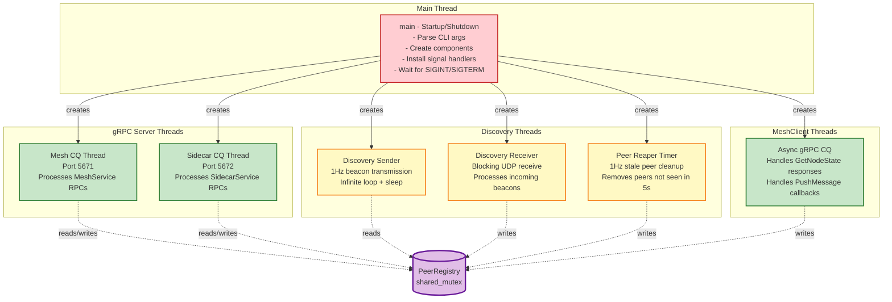
```mermaid
graph TD
    subgraph "Main Thread"
        MAIN[main - Startup/Shutdown<br/>- Parse CLI args<br/>- Create components<br/>- Install signal handlers<br/>- Wait for SIGINT/SIGTERM]
    end
    
    subgraph "gRPC Server Threads"
        CQ1[Mesh CQ Thread<br/>Port 5671<br/>Processes MeshService RPCs]
        CQ2[Sidecar CQ Thread<br/>Port 5672<br/>Processes SidecarService RPCs]
    end
    
    subgraph "Discovery Threads"
        SENDER[Discovery Sender<br/>1Hz beacon transmission<br/>Infinite loop + sleep]
        RECEIVER[Discovery Receiver<br/>Blocking UDP receive<br/>Processes incoming beacons]
        REAPER[Peer Reaper Timer<br/>1Hz stale peer cleanup<br/>Removes peers not seen in 5s]
    end
    
    subgraph "MeshClient Threads"
        ASYNC[Async gRPC CQ<br/>Handles GetNodeState responses<br/>Handles PushMessage callbacks]
    end
    
    MAIN -->|creates| CQ1
    MAIN -->|creates| CQ2
    MAIN -->|creates| SENDER
    MAIN -->|creates| RECEIVER
    MAIN -->|creates| REAPER
    MAIN -->|creates| ASYNC
    
    CQ1 -.reads/writes.-> REGISTRY[(PeerRegistry<br/>shared_mutex)]
    CQ2 -.reads/writes.-> REGISTRY
    SENDER -.reads.-> REGISTRY
    RECEIVER -.writes.-> REGISTRY
    REAPER -.writes.-> REGISTRY
    ASYNC -.writes.-> REGISTRY
    
    classDef mainThread fill:#ffcdd2,stroke:#c62828,stroke-width:2px
    classDef grpcThread fill:#c8e6c9,stroke:#2e7d32,stroke-width:2px
    classDef discoveryThread fill:#fff9c4,stroke:#f57f17,stroke-width:2px
    classDef storage fill:#e1bee7,stroke:#6a1b9a,stroke-width:3px
    
    class MAIN mainThread
    class CQ1,CQ2,ASYNC grpcThread
    class SENDER,RECEIVER,REAPER discoveryThread
    class REGISTRY storage
```

**Thread Details:**

| Thread | Lifecycle | Blocking Operations | CPU Usage | Notes |
|--------|-----------|---------------------|-----------|-------|
| **Main** | Runs until SIGINT/SIGTERM | `signal_wait()` or event loop | Idle | Performs graceful shutdown on signal |
| **Mesh CQ** | Created by gRPC ServerBuilder | gRPC completion queue polling | Low (event-driven) | Handles GetNodeState, PushMessage callbacks |
| **Sidecar CQ** | Created by gRPC ServerBuilder | gRPC completion queue polling | Low (event-driven) | Handles Publish, Subscribe, Unsubscribe callbacks |
| **Discovery Sender** | `DiscoveryAgent::start()` → `::stop()` | `std::this_thread::sleep_for(1s)` | Very low | Sends 1 UDP packet per second |
| **Discovery Receiver** | `DiscoveryAgent::start()` → `::stop()` | `UDPSocket::receiveFrom()` (blocking) | Low | Wakes on incoming UDP packets |
| **Peer Reaper** | `DiscoveryAgent::start()` → `::stop()` | `std::this_thread::sleep_for(1s)` | Very low | Iterates peers, removes stale |
| **MeshClient Async CQ** | Created on first `MeshClient` usage | gRPC completion queue polling | Low | Async callbacks for sync RPCs |

**Thread Creation Code Paths**:

```cpp
// main.cpp
int main() {
    // 1. Main thread - already running
    
    // 2. Discovery threads (created in DiscoveryAgent::start())
    senderThread_ = std::thread(&DiscoveryAgent::senderLoop, this);
    receiverThread_ = std::thread(&DiscoveryAgent::receiverLoop, this);
    reaperThread_ = std::thread(&DiscoveryAgent::reaperLoop, this);
    
    // 3. gRPC threads (created internally by grpc::Server::Start())
    auto mesh_server = mesh_builder.BuildAndStart();  // Creates CQ thread pool
    auto sidecar_server = sidecar_builder.BuildAndStart();
    
    // 4. Main thread blocks
    mesh_server->Wait();  // or signal handler
}
```

### Concurrency Control

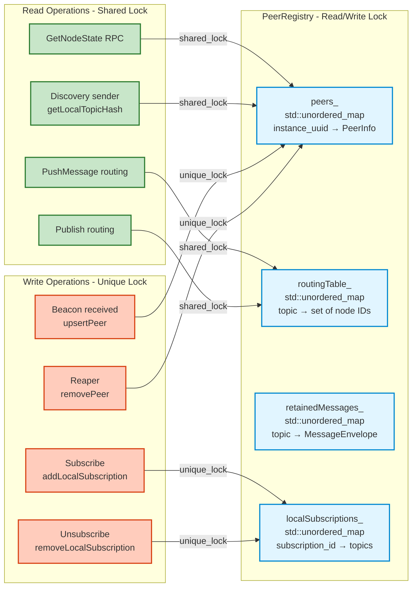
```mermaid
graph LR
    subgraph "PeerRegistry - Read/Write Lock"
        PEER_DATA[peers_<br/>std::unordered_map<br/>instance_uuid → PeerInfo]
        ROUTING_DATA[routingTable_<br/>std::unordered_map<br/>topic → set of node IDs]
        RETAINED_DATA[retainedMessages_<br/>std::unordered_map<br/>topic → MessageEnvelope]
        SUBSCRIPTION_DATA[localSubscriptions_<br/>std::unordered_map<br/>subscription_id → topics]
    end
    
    subgraph "Read Operations - Shared Lock"
        READ1[GetNodeState RPC]
        READ2[PushMessage routing]
        READ3[Publish routing]
        READ4[Discovery sender<br/>getLocalTopicHash]
    end
    
    subgraph "Write Operations - Unique Lock"
        WRITE1[Beacon received<br/>upsertPeer]
        WRITE2[Subscribe<br/>addLocalSubscription]
        WRITE3[Unsubscribe<br/>removeLocalSubscription]
        WRITE4[Reaper<br/>removePeer]
    end
    
    READ1 -->|shared_lock| PEER_DATA
    READ2 -->|shared_lock| ROUTING_DATA
    READ3 -->|shared_lock| ROUTING_DATA
    READ4 -->|shared_lock| PEER_DATA
    
    WRITE1 -->|unique_lock| PEER_DATA
    WRITE2 -->|unique_lock| SUBSCRIPTION_DATA
    WRITE3 -->|unique_lock| SUBSCRIPTION_DATA
    WRITE4 -->|unique_lock| PEER_DATA
    
    classDef readOp fill:#c8e6c9,stroke:#2e7d32,stroke-width:2px
    classDef writeOp fill:#ffccbc,stroke:#d84315,stroke-width:2px
    classDef data fill:#e1f5ff,stroke:#0288d1,stroke-width:2px
    
    class READ1,READ2,READ3,READ4 readOp
    class WRITE1,WRITE2,WRITE3,WRITE4 writeOp
    class PEER_DATA,ROUTING_DATA,RETAINED_DATA,SUBSCRIPTION_DATA data
```

**Lock Hierarchy & Deadlock Prevention**:

1. **PeerRegistry uses 4 separate mutexes** to reduce contention:
   - `peerMutex_` (std::shared_mutex) - protects `peers_` and `routingTable_`
   - `retainedMutex_` (std::shared_mutex) - protects `retainedMessages_`
   - `subscriptionMutex_` (std::shared_mutex) - protects `localSubscriptions_` and `subscriptionStreams_`
   - `hashMutex_` (std::mutex) - protects cached `currentTopicHash_`

2. **Lock Ordering Rule**: Always acquire in this order (if multiple needed):
   ```
   subscriptionMutex_ → peerMutex_ → retainedMutex_ → hashMutex_
   ```
   Example: `rebuildRoutingTable()` acquires `subscriptionMutex_` then `peerMutex_`

3. **Readers-Writer Pattern**:
   - Publish/Subscribe hotpath uses `shared_lock` (multiple concurrent readers)
   - State changes (upsert/remove peer, subscribe/unsubscribe) use `unique_lock`
   - Optimization: 99% of operations are reads (routing lookups)

4. **Lock-Free Paths**:
   - Message payload never copied while holding locks
   - gRPC Reactor callbacks don't hold locks during I/O

**Mutex Acquisition Examples**:

```cpp
// Read path (shared lock) - multiple threads can enter
uint64_t PeerRegistry::getLocalTopicHash() const {
    std::shared_lock<std::shared_mutex> lock(hashMutex_);
    return currentTopicHash_;
}

// Write path (unique lock) - exclusive access
void PeerRegistry::upsertPeer(const PeerInfo& info) {
    std::unique_lock<std::shared_mutex> lock(peerMutex_);
    peers_[info.instance_uuid] = std::make_shared<PeerInfo>(info);
    // ... update logic
}

// Read-modify-write (upgrade pattern not used, always unique)
void PeerRegistry::addLocalSubscription(const string& id, const vector<string>& topics) {
    std::unique_lock<std::shared_mutex> subLock(subscriptionMutex_);
    localSubscriptions_[id].insert(topics.begin(), topics.end());
    
    // Need routing table update - acquire second lock
    std::unique_lock<std::shared_mutex> peerLock(peerMutex_);
    rebuildRoutingTable();  // Already has lock, won't double-lock
}
```

### Thread Interaction Patterns

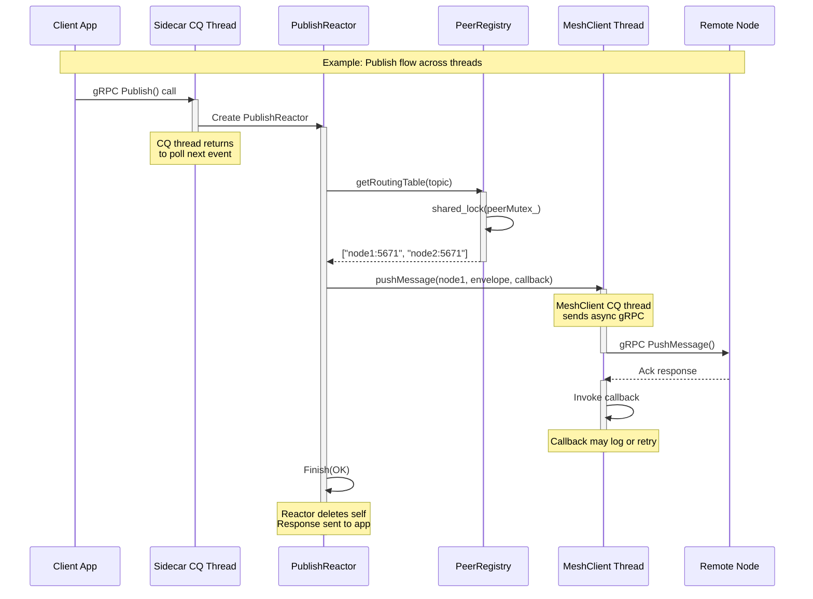
```mermaid
sequenceDiagram
    participant App as Client App
    participant CQT as Sidecar CQ Thread
    participant Reactor as PublishReactor
    participant Registry as PeerRegistry
    participant MCT as MeshClient Thread
    participant Remote as Remote Node
    
    Note over App,Remote: Example: Publish flow across threads
    
    App->>CQT: gRPC Publish() call
    activate CQT
    CQT->>Reactor: Create PublishReactor
    activate Reactor
    
    Note over CQT: CQ thread returns<br/>to poll next event
    deactivate CQT
    
    Reactor->>Registry: getRoutingTable(topic)
    activate Registry
    Registry->>Registry: shared_lock(peerMutex_)
    Registry-->>Reactor: ["node1:5671", "node2:5671"]
    deactivate Registry
    
    Reactor->>MCT: pushMessage(node1, envelope, callback)
    activate MCT
    Note over MCT: MeshClient CQ thread<br/>sends async gRPC
    MCT->>Remote: gRPC PushMessage()
    deactivate MCT
    
    Remote-->>MCT: Ack response
    activate MCT
    MCT->>MCT: Invoke callback
    Note over MCT: Callback may log or retry
    deactivate MCT
    
    Reactor->>Reactor: Finish(OK)
    Note over Reactor: Reactor deletes self<br/>Response sent to app
    deactivate Reactor
```

**Key Properties**:

- **No Blocking in CQ Threads**: gRPC completion queue threads never block on I/O or long operations
- **Reactor Pattern**: Request handling offloaded to heap-allocated Reactor objects
- **Async Callbacks**: Remote calls use callbacks, never wait synchronously
- **Lock Minimization**: Locks held only during data structure modification, not during network I/O

## Configuration

All configuration is provided via **CLI flags only** - no config file required. This simplifies container deployments and Kubernetes ConfigMaps.

### Configuration Parameters

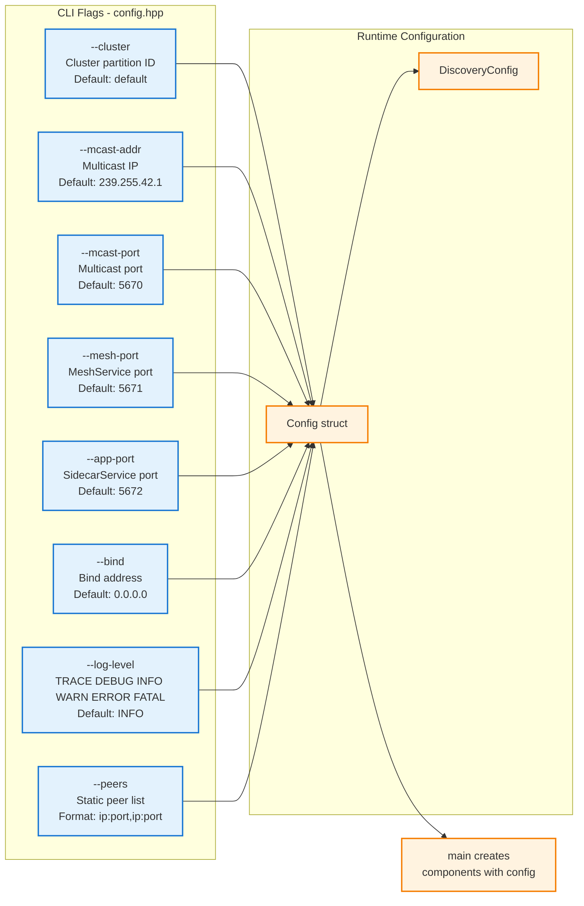
```mermaid
graph LR
    subgraph "CLI Flags - config.hpp"
        CLUSTER[--cluster<br/>Cluster partition ID<br/>Default: default]
        MCAST_ADDR[--mcast-addr<br/>Multicast IP<br/>Default: 239.255.42.1]
        MCAST_PORT[--mcast-port<br/>Multicast port<br/>Default: 5670]
        MESH_PORT[--mesh-port<br/>MeshService port<br/>Default: 5671]
        APP_PORT[--app-port<br/>SidecarService port<br/>Default: 5672]
        BIND[--bind<br/>Bind address<br/>Default: 0.0.0.0]
        LOG[--log-level<br/>TRACE DEBUG INFO WARN ERROR FATAL<br/>Default: INFO]
        PEERS[--peers<br/>Static peer list<br/>Format: ip:port,ip:port]
    end
    
    subgraph "Runtime Configuration"
        CONFIG[Config struct]
        DISC_CONFIG[DiscoveryConfig]
    end
    
    CLUSTER --> CONFIG
    MCAST_ADDR --> CONFIG
    MCAST_PORT --> CONFIG
    MESH_PORT --> CONFIG
    APP_PORT --> CONFIG
    BIND --> CONFIG
    LOG --> CONFIG
    PEERS --> CONFIG
    
    CONFIG --> DISC_CONFIG
    CONFIG --> MAIN[main creates<br/>components with config]
    
    classDef flag fill:#e3f2fd,stroke:#1976d2,stroke-width:2px
    classDef config fill:#fff3e0,stroke:#f57c00,stroke-width:2px
    
    class CLUSTER,MCAST_ADDR,MCAST_PORT,MESH_PORT,APP_PORT,BIND,LOG,PEERS flag
    class CONFIG,DISC_CONFIG,MAIN config
```

### Parameter Details

| Parameter | Type | Default | Environment Variable | Description | Example |
|-----------|------|---------|---------------------|-------------|---------|
| `--cluster` | string | "default" | `NEXUSD_CLUSTER` | Cluster partition key. Nodes with different cluster IDs ignore each other's beacons. | `--cluster=prod-us-west` |
| `--mcast-addr` | IP | 239.255.42.1 | `NEXUSD_MCAST_ADDR` | UDP multicast group address (IANA reserved 239.0.0.0/8) | `--mcast-addr=239.255.42.10` |
| `--mcast-port` | int | 5670 | `NEXUSD_MCAST_PORT` | UDP multicast port | `--mcast-port=7000` |
| `--mesh-port` | int | 5671 | `NEXUSD_MESH_PORT` | TCP port for inter-node gRPC MeshService | `--mesh-port=50051` |
| `--app-port` | int | 5672 | `NEXUSD_APP_PORT` | TCP port for local gRPC SidecarService (binds to 127.0.0.1) | `--app-port=50052` |
| `--bind` | IP | 0.0.0.0 | `NEXUSD_BIND_ADDR` | Bind address for MeshService (SidecarService always binds 127.0.0.1) | `--bind=192.168.1.10` |
| `--log-level` | enum | INFO | `NEXUSD_LOG_LEVEL` | Logging verbosity: TRACE, DEBUG, INFO, WARN, ERROR, FATAL | `--log-level=DEBUG` |
| `--peers` | CSV | (empty) | `NEXUSD_PEERS` | Static peer list (disables UDP discovery if provided). Format: `ip1:port1,ip2:port2` | `--peers=10.0.1.10:5671,10.0.1.11:5671` |

**Environment Variable Support**: All flags can be set via environment variables (useful for Docker/Kubernetes). CLI flags override environment variables.

**Usage Examples**:

```bash
# Basic usage (all defaults)
./nexusd

# Production cluster with static peers (Kubernetes)
./nexusd \
  --cluster=prod-orders \
  --peers=nexusd-0.nexusd-headless.default.svc.cluster.local:5671,\
          nexusd-1.nexusd-headless.default.svc.cluster.local:5671,\
          nexusd-2.nexusd-headless.default.svc.cluster.local:5671 \
  --log-level=INFO

# Debug mode with custom ports
./nexusd --mesh-port=6000 --app-port=6001 --log-level=TRACE

# Multiple clusters on same network (using different cluster IDs)
./nexusd --cluster=cluster-a --mcast-port=5670  # Cluster A
./nexusd --cluster=cluster-b --mcast-port=5670  # Cluster B (ignores cluster-a)
```

### Configuration Validation

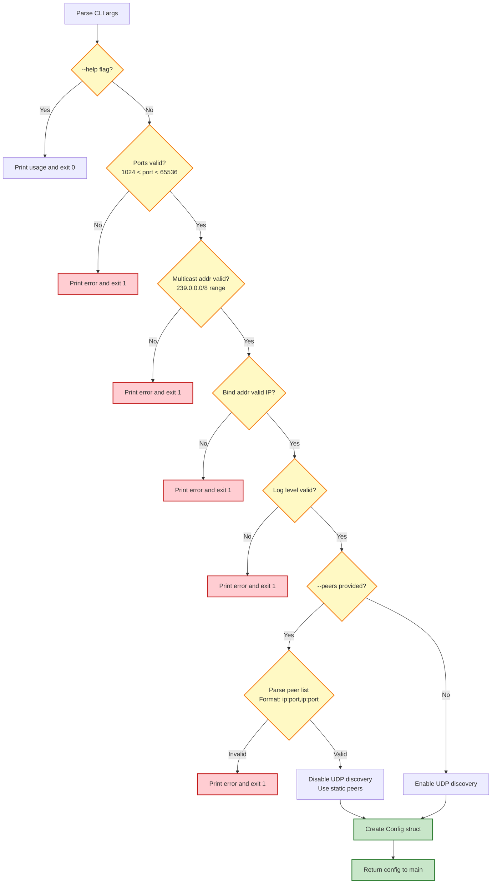
```mermaid
flowchart TD
    START[Parse CLI args] --> CHECK_HELP{--help flag?}
    CHECK_HELP -->|Yes| PRINT_HELP[Print usage and exit 0]
    CHECK_HELP -->|No| CHECK_PORTS{Ports valid?<br/>1024 < port < 65536}
    
    CHECK_PORTS -->|No| ERROR_PORT[Print error and exit 1]
    CHECK_PORTS -->|Yes| CHECK_MCAST{Multicast addr valid?<br/>239.0.0.0/8 range}
    
    CHECK_MCAST -->|No| ERROR_MCAST[Print error and exit 1]
    CHECK_MCAST -->|Yes| CHECK_BIND{Bind addr valid IP?}
    
    CHECK_BIND -->|No| ERROR_BIND[Print error and exit 1]
    CHECK_BIND -->|Yes| CHECK_LOG{Log level valid?}
    
    CHECK_LOG -->|No| ERROR_LOG[Print error and exit 1]
    CHECK_LOG -->|Yes| CHECK_PEERS{--peers provided?}
    
    CHECK_PEERS -->|Yes| VALIDATE_PEERS{Parse peer list<br/>Format: ip:port,ip:port}
    VALIDATE_PEERS -->|Invalid| ERROR_PEERS[Print error and exit 1]
    VALIDATE_PEERS -->|Valid| DISABLE_DISCOVERY[Disable UDP discovery<br/>Use static peers]
    
    CHECK_PEERS -->|No| ENABLE_DISCOVERY[Enable UDP discovery]
    
    DISABLE_DISCOVERY --> CREATE_CONFIG[Create Config struct]
    ENABLE_DISCOVERY --> CREATE_CONFIG
    CREATE_CONFIG --> RETURN[Return config to main]
    
    classDef error fill:#ffcdd2,stroke:#c62828,stroke-width:2px
    classDef success fill:#c8e6c9,stroke:#2e7d32,stroke-width:2px
    classDef decision fill:#fff9c4,stroke:#f57f17,stroke-width:2px
    
    class ERROR_PORT,ERROR_MCAST,ERROR_BIND,ERROR_LOG,ERROR_PEERS error
    class CREATE_CONFIG,RETURN success
    class CHECK_HELP,CHECK_PORTS,CHECK_MCAST,CHECK_BIND,CHECK_LOG,CHECK_PEERS,VALIDATE_PEERS decision
```

**Validation Rules**:

1. **Port Ranges**: All ports must be in range [1024, 65535] (avoid privileged ports <1024)
2. **Multicast Address**: Must be in IANA-reserved multicast range 239.0.0.0/8 (organization-local scope)
3. **Bind Address**: Must be valid IPv4 address or "0.0.0.0"
4. **Log Level**: Must be one of: TRACE, DEBUG, INFO, WARN, ERROR, FATAL (case-insensitive)
5. **Peer List Format**: `ip:port` or `hostname:port`, comma-separated, no spaces
6. **Mutual Exclusivity**: If `--peers` provided, UDP discovery is automatically disabled

**Code Location**: `include/nexusd/daemon/config.hpp`, `src/daemon/config.cpp`

## Protocol Specifications

### Wire Formats

NexusD uses Protocol Buffers for all serialization (both UDP beacons and gRPC RPCs).

#### Discovery Protocol (UDP Multicast)

**Transport**: UDP multicast to `239.255.42.1:5670` (default)

**Beacon Message Structure**:

```protobuf
message Beacon {
    string instance_uuid = 1;        // UUID v4 (36 chars) - session ID
    string cluster_id = 2;           // Cluster partition key (e.g., "prod")
    string rpc_ip = 3;               // IP where MeshService listens
    int32 rpc_port = 4;              // Port where MeshService listens (default 5671)
    uint64 topic_state_hash = 5;     // CRC64 of sorted topic list
    int64 timestamp_ms = 6;          // Milliseconds since epoch
    int32 protocol_version = 7;      // Current version: 1
}
```

**Beacon Lifecycle**:

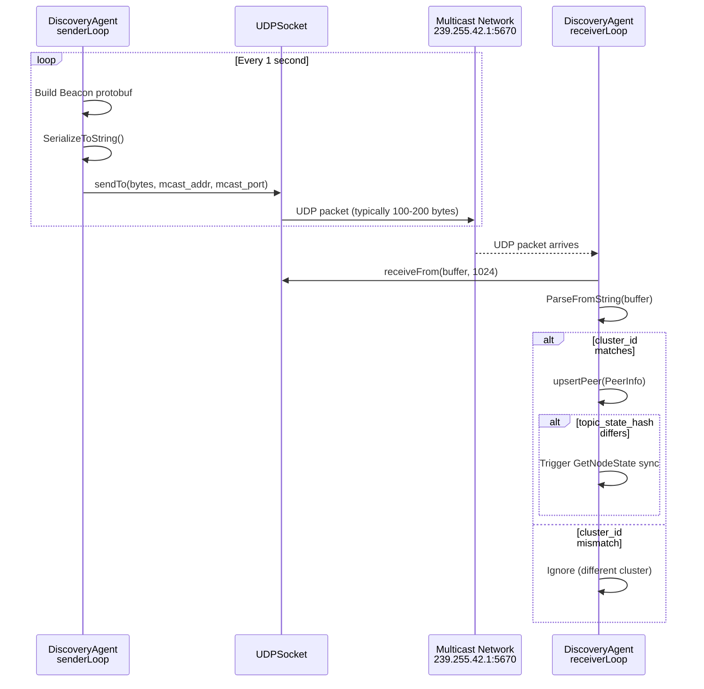
```mermaid
sequenceDiagram
    participant Sender as DiscoveryAgent<br/>senderLoop
    participant Socket as UDPSocket
    participant Network as Multicast Network<br/>239.255.42.1:5670
    participant Receiver as DiscoveryAgent<br/>receiverLoop
    
    loop Every 1 second
        Sender->>Sender: Build Beacon protobuf
        Sender->>Sender: SerializeToString()
        Sender->>Socket: sendTo(bytes, mcast_addr, mcast_port)
        Socket->>Network: UDP packet (typically 100-200 bytes)
    end
    
    Network-->>Receiver: UDP packet arrives
    Receiver->>Socket: receiveFrom(buffer, 1024)
    Receiver->>Receiver: ParseFromString(buffer)
    
    alt cluster_id matches
        Receiver->>Receiver: upsertPeer(PeerInfo)
        alt topic_state_hash differs
            Receiver->>Receiver: Trigger GetNodeState sync
        end
    else cluster_id mismatch
        Receiver->>Receiver: Ignore (different cluster)
    end
```

**Wire Format Example**:

```
Protobuf serialized (binary):
Offset  Hex                                          ASCII
------  -------------------------------------------  -----
0x00    0a 24 35 35 30 65 38 34 30 30 2d 65 32 39  ..$550e8400-e29
0x10    62 2d 34 31 64 34 2d 61 37 31 36 2d 34 34  b-41d4-a716-44
0x20    36 36 35 35 34 34 30 30 30 30 12 07 64 65  6655440000..de
0x30    66 61 75 6c 74 1a 0b 31 39 32 2e 31 36 38  fault..192.168
0x40    2e 31 2e 31 30 20 d3 28 28 cd ab 34 12 78  .1.10 .(.....4.x
0x50    56 34 12 30 e0 8d a6 f4 b5 2f 38 01        V4.0...../8.

Decoded fields:
instance_uuid: "550e8400-e29b-41d4-a716-446655440000"
cluster_id: "default"
rpc_ip: "192.168.1.10"
rpc_port: 5651
topic_state_hash: 1234567890123
timestamp_ms: 1638360000000
protocol_version: 1
```

#### Mesh Protocol (gRPC - Node-to-Node)

**Transport**: gRPC over TCP (default port 5671)

**Service Definition**:

```protobuf
service MeshService {
    rpc GetNodeState(google.protobuf.Empty) returns (NodeState);
    rpc PushMessage(MessageEnvelope) returns (Ack);
    rpc PushMessageStream(stream MessageEnvelope) returns (stream Ack);
}
```

**GetNodeState RPC**:

Purpose: Anti-entropy synchronization when hash mismatch detected

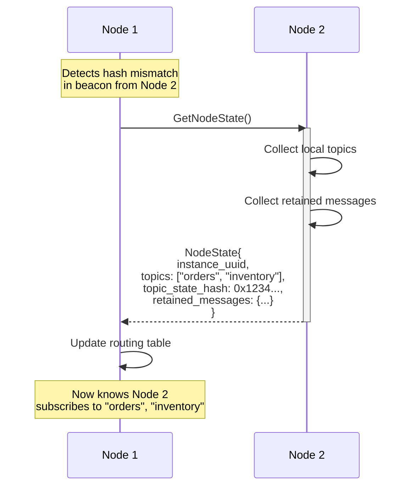
```mermaid
sequenceDiagram
    participant Node1 as Node 1
    participant Node2 as Node 2
    
    Note over Node1: Detects hash mismatch<br/>in beacon from Node 2
    
    Node1->>Node2: GetNodeState()
    activate Node2
    Node2->>Node2: Collect local topics
    Node2->>Node2: Collect retained messages
    Node2-->>Node1: NodeState{<br/>  instance_uuid,<br/>  topics: ["orders", "inventory"],<br/>  topic_state_hash: 0x1234...,<br/>  retained_messages: {...}<br/>}
    deactivate Node2
    
    Node1->>Node1: Update routing table
    Note over Node1: Now knows Node 2<br/>subscribes to "orders", "inventory"
```

**PushMessage RPC**:

Purpose: Forward published message to remote subscriber

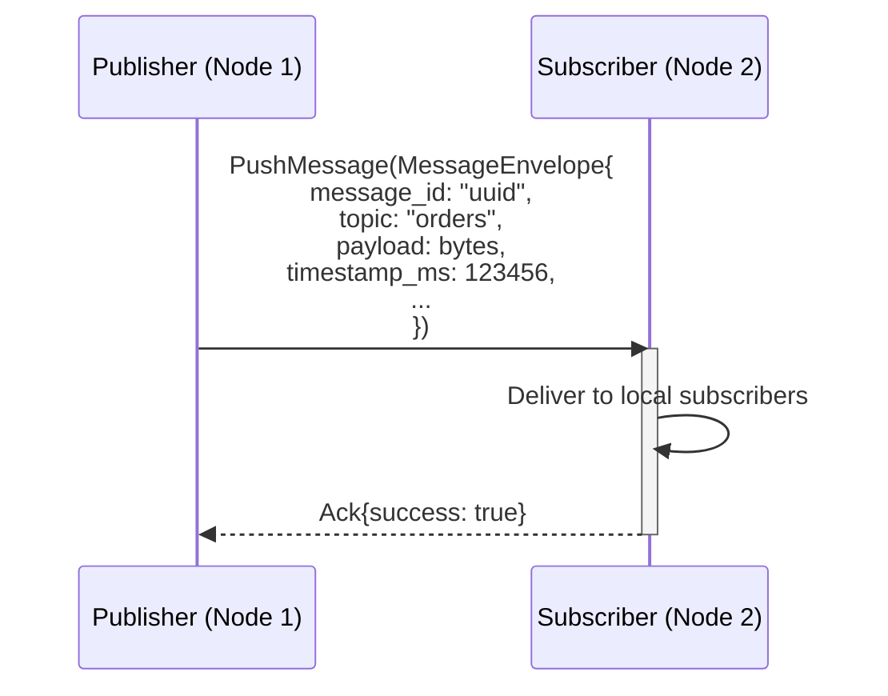
```mermaid
sequenceDiagram
    participant Pub as Publisher (Node 1)
    participant Sub as Subscriber (Node 2)
    
    Pub->>Sub: PushMessage(MessageEnvelope{<br/>  message_id: "uuid",<br/>  topic: "orders",<br/>  payload: bytes,<br/>  timestamp_ms: 123456,<br/>  ...<br/>})
    activate Sub
    Sub->>Sub: Deliver to local subscribers
    Sub-->>Pub: Ack{success: true}
    deactivate Sub
```

#### Sidecar Protocol (gRPC - App-to-Daemon)

**Transport**: gRPC over TCP (default port 5672, binds to 127.0.0.1 only)

**Service Definition**:

```protobuf
service SidecarService {
    rpc Publish(PublishRequest) returns (PublishResponse);
    rpc Subscribe(SubscribeRequest) returns (stream MessageEvent);
    rpc Unsubscribe(UnsubscribeRequest) returns (UnsubscribeResponse);
    rpc GetTopics(GetTopicsRequest) returns (GetTopicsResponse);
    rpc GetPeers(GetPeersRequest) returns (GetPeersResponse);
}
```

**Publish Flow**:

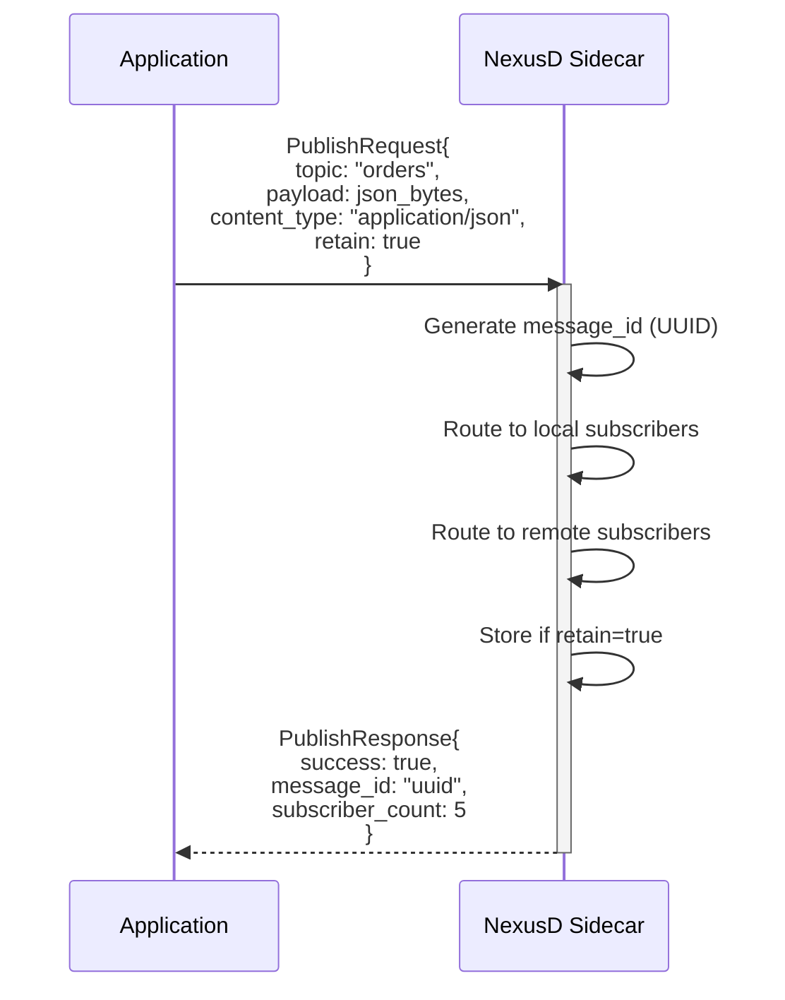
```mermaid
sequenceDiagram
    participant App as Application
    participant Daemon as NexusD Sidecar
    
    App->>Daemon: PublishRequest{<br/>  topic: "orders",<br/>  payload: json_bytes,<br/>  content_type: "application/json",<br/>  retain: true<br/>}
    activate Daemon
    Daemon->>Daemon: Generate message_id (UUID)
    Daemon->>Daemon: Route to local subscribers
    Daemon->>Daemon: Route to remote subscribers
    Daemon->>Daemon: Store if retain=true
    Daemon-->>App: PublishResponse{<br/>  success: true,<br/>  message_id: "uuid",<br/>  subscriber_count: 5<br/>}
    deactivate Daemon
```

**Subscribe Flow** (Server Streaming):

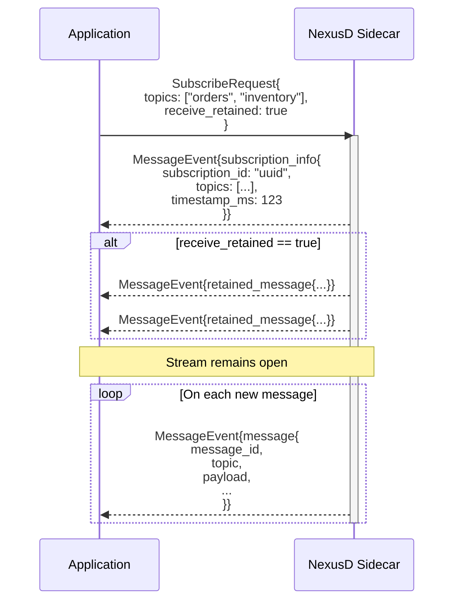
```mermaid
sequenceDiagram
    participant App as Application
    participant Daemon as NexusD Sidecar
    
    App->>Daemon: SubscribeRequest{<br/>  topics: ["orders", "inventory"],<br/>  receive_retained: true<br/>}
    activate Daemon
    
    Daemon-->>App: MessageEvent{subscription_info{<br/>  subscription_id: "uuid",<br/>  topics: [...],<br/>  timestamp_ms: 123<br/>}}
    
    alt receive_retained == true
        Daemon-->>App: MessageEvent{retained_message{...}}
        Daemon-->>App: MessageEvent{retained_message{...}}
    end
    
    Note over Daemon,App: Stream remains open
    
    loop On each new message
        Daemon-->>App: MessageEvent{message{<br/>  message_id,<br/>  topic,<br/>  payload,<br/>  ...<br/>}}
    end
    
    deactivate Daemon
```

## Error Handling

### Error Categories and Recovery Strategies


```mermaid
graph TD
    subgraph "Transient Errors - Retry"
        NET_TIMEOUT[Network timeout<br/>gRPC DEADLINE_EXCEEDED]
        UNAVAILABLE[Remote unavailable<br/>gRPC UNAVAILABLE]
        UDP_SEND_FAIL[UDP send failed<br/>Network congestion]
    end
    
    subgraph "Permanent Errors - Log & Skip"
        INVALID_MSG[Invalid protobuf<br/>ParseFromString failed]
        PERMISSION[Permission denied<br/>Port binding failed]
        RESOURCE[Resource exhausted<br/>Too many open files]
    end
    
    subgraph "Fatal Errors - Exit Process"
        INIT_FAIL[Initialization failure<br/>gRPC server failed to start]
        CONFIG_ERROR[Invalid configuration<br/>Bad port number]
        ASSERT_FAIL[Assertion failure<br/>Invariant violated]
    end
    
    NET_TIMEOUT --> RETRY[Retry with backoff<br/>or skip to next cycle]
    UNAVAILABLE --> RETRY
    UDP_SEND_FAIL --> RETRY
    
    INVALID_MSG --> LOG[Log ERROR and continue<br/>Peer marked as problematic]
    PERMISSION --> LOG
    RESOURCE --> LOG
    
    INIT_FAIL --> EXIT[Log FATAL and exit 1]
    CONFIG_ERROR --> EXIT
    ASSERT_FAIL --> EXIT
    
    classDef transient fill:#fff9c4,stroke:#f57f17,stroke-width:2px
    classDef permanent fill:#ffccbc,stroke:#d84315,stroke-width:2px
    classDef fatal fill:#ffcdd2,stroke:#c62828,stroke-width:3px
    
    class NET_TIMEOUT,UNAVAILABLE,UDP_SEND_FAIL transient
    class INVALID_MSG,PERMISSION,RESOURCE permanent
    class INIT_FAIL,CONFIG_ERROR,ASSERT_FAIL fatal
```

### Error Handling by Component

| Component | Error Type | Handling Strategy | Example Code |
|-----------|------------|-------------------|--------------|
| **DiscoveryAgent** | UDP send failure | Log WARN, continue to next beacon cycle | `if (!socket.sendTo(...)) { LOG_WARN("Beacon send failed"); }` |
| | Beacon parse failure | Log WARN, discard packet | `if (!beacon.ParseFromString(buf)) { LOG_WARN("Invalid beacon"); return; }` |
| | Multicast join failure | Log FATAL, exit process | `if (!socket.joinMulticastGroup(...)) { LOG_FATAL("..."); exit(1); }` |
| **MeshClient** | GetNodeState timeout | Log ERROR, peer remains unsynced, retry next beacon | `callback(false, empty_state);` |
| | PushMessage failure | Log ERROR, message lost for that peer | `LOG_ERROR("Failed to forward to {}", endpoint);` |
| | Channel creation failure | Log ERROR, peer unreachable | `LOG_ERROR("Cannot create channel to {}", endpoint);` |
| **SidecarService** | Invalid topic name (empty) | Return gRPC INVALID_ARGUMENT | `Finish(Status(INVALID_ARGUMENT, "Topic cannot be empty"));` |
| | No subscribers found | Return success with subscriber_count=0 | `PublishResponse{success=true, subscriber_count=0}` |
| | Subscription stream cancelled | Clean up resources, remove subscription | `OnCancel() { removeSubscription(id); delete this; }` |
| **MeshService** | Local subscriber delivery failure | Log ERROR, continue to next subscriber | `try { deliver(); } catch(...) { LOG_ERROR("..."); }` |
| | Duplicate message_id | Silently discard (deduplication) | `if (seenMessages.count(msg_id)) return;` |
| **PeerRegistry** | Hash collision (extremely rare) | Force full sync | `LOG_WARN("Hash collision detected"); forceSyncAll();` |
| **Logger** | Disk full (file logging) | Switch to stderr only | `catch (ios_base::failure) { use_stderr_only = true; }` |

### gRPC Status Code Mapping

| gRPC Status | Cause | Client Action |
|-------------|-------|---------------|
| `OK` | Success | Process response |
| `CANCELLED` | Client cancelled RPC | Clean up resources |
| `UNKNOWN` | Internal server error | Retry with exponential backoff |
| `INVALID_ARGUMENT` | Bad request (e.g., empty topic) | Fix request and retry |
| `DEADLINE_EXCEEDED` | Timeout (default 5s) | Retry or mark peer as slow |
| `NOT_FOUND` | Resource doesn't exist | Don't retry |
| `ALREADY_EXISTS` | Duplicate operation | Idempotent - treat as success |
| `PERMISSION_DENIED` | Authorization failure (future TLS) | Don't retry, alert operator |
| `RESOURCE_EXHAUSTED` | Rate limit, queue full | Retry with backoff |
| `FAILED_PRECONDITION` | Invalid state | Check assumptions and retry |
| `ABORTED` | Conflict, retry possible | Retry with exponential backoff |
| `UNIMPLEMENTED` | Method not supported | Version mismatch, alert operator |
| `UNAVAILABLE` | Server down or unreachable | Retry, mark peer as SUSPECTED |
| `UNAUTHENTICATED` | Missing credentials (future mTLS) | Don't retry, fix configuration |

### Graceful Shutdown Sequence

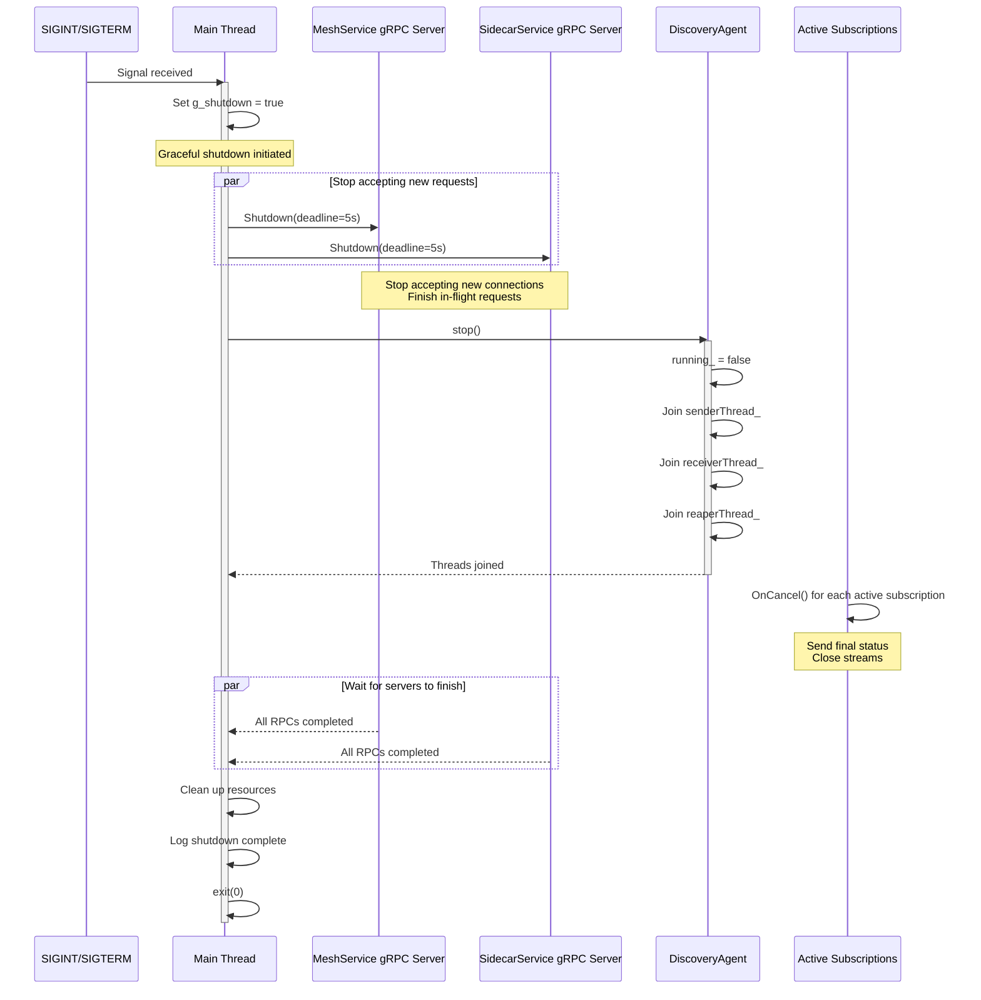
```mermaid
sequenceDiagram
    participant Signal as SIGINT/SIGTERM
    participant Main as Main Thread
    participant Mesh as MeshService gRPC Server
    participant Sidecar as SidecarService gRPC Server
    participant Disc as DiscoveryAgent
    participant Reactor as Active Subscriptions
    
    Signal->>Main: Signal received
    activate Main
    Main->>Main: Set g_shutdown = true
    
    Note over Main: Graceful shutdown initiated
    
    par Stop accepting new requests
        Main->>Mesh: Shutdown(deadline=5s)
        Main->>Sidecar: Shutdown(deadline=5s)
    end
    
    Note over Mesh,Sidecar: Stop accepting new connections<br/>Finish in-flight requests
    
    Main->>Disc: stop()
    activate Disc
    Disc->>Disc: running_ = false
    Disc->>Disc: Join senderThread_
    Disc->>Disc: Join receiverThread_
    Disc->>Disc: Join reaperThread_
    Disc-->>Main: Threads joined
    deactivate Disc
    
    Reactor->>Reactor: OnCancel() for each active subscription
    Note over Reactor: Send final status<br/>Close streams
    
    par Wait for servers to finish
        Mesh-->>Main: All RPCs completed
        Sidecar-->>Main: All RPCs completed
    end
    
    Main->>Main: Clean up resources
    Main->>Main: Log shutdown complete
    Main->>Main: exit(0)
    deactivate Main
```

**Shutdown Guarantees**:

1. **No New Connections**: gRPC servers stop accepting after `Shutdown()` called
2. **In-Flight RPCs**: Completed within 5-second deadline
3. **Discovery Threads**: Cleanly joined (no orphaned threads)
4. **Active Subscriptions**: Receive cancellation notification
5. **Resource Cleanup**: All file descriptors, sockets, memory freed

## Performance Characteristics

### Latency Benchmarks

**Test Environment**: 3-node cluster, Intel Xeon E5-2686v4, 10Gbps network, Ubuntu 22.04

| Operation | Latency (p50) | Latency (p99) | Throughput | Notes |
|-----------|---------------|---------------|------------|-------|
| **Local Publish** (same node) | 0.8 ms | 1.5 ms | ~100K msg/s | gRPC unary call + local stream write |
| **Remote Publish** (1 hop) | 2.3 ms | 4.2 ms | ~50K msg/s | Includes gRPC call to remote peer |
| **Subscribe** (initial) | 1.2 ms | 2.1 ms | N/A | Opens streaming RPC + sends retained |
| **Beacon Processing** | 0.3 ms | 0.6 ms | N/A | Deserialize + upsertPeer |
| **GetNodeState** sync | 5.2 ms | 12 ms | N/A | Full state transfer, depends on topic count |
| **Message Size 1KB** | +0.1 ms | +0.2 ms | -5% | Linear scaling up to 1MB |
| **Message Size 1MB** | +15 ms | +28 ms | -60% | gRPC chunking overhead |

**Latency Breakdown** (Local Publish):


```mermaid
gantt
    title Local Publish Latency Breakdown (0.8ms total)
    dateFormat X
    axisFormat %L
    
    section gRPC
    Request serialization    :0, 100
    CQ enqueue              :100, 150
    
    section Reactor
    PublishReactor creation :150, 200
    Lookup subscribers      :200, 400
    
    section Delivery
    Enqueue to streams      :400, 600
    StartWrite callbacks    :600, 750
    
    section Response
    Serialize response      :750, 800
```

### Throughput Limits

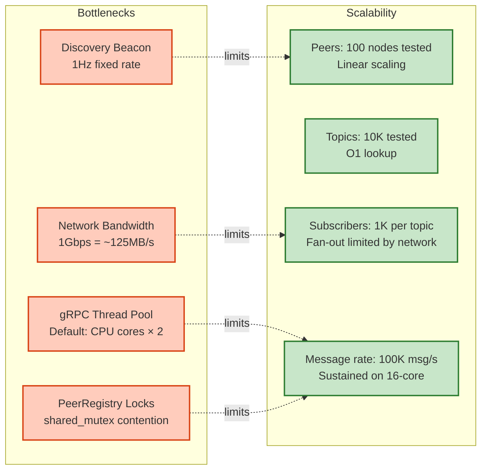
```mermaid
graph LR
    subgraph "Bottlenecks"
        B1[gRPC Thread Pool<br/>Default: CPU cores × 2]
        B2[PeerRegistry Locks<br/>shared_mutex contention]
        B3[Network Bandwidth<br/>1Gbps = ~125MB/s]
        B4[Discovery Beacon<br/>1Hz fixed rate]
    end
    
    subgraph "Scalability"
        S1[Peers: 100 nodes tested<br/>Linear scaling]
        S2[Topics: 10K tested<br/>O1 lookup]
        S3[Subscribers: 1K per topic<br/>Fan-out limited by network]
        S4[Message rate: 100K msg/s<br/>Sustained on 16-core]
    end
    
    B1 -.limits.-> S4
    B2 -.limits.-> S4
    B3 -.limits.-> S3
    B4 -.limits.-> S1
    
    classDef bottleneck fill:#ffccbc,stroke:#d84315,stroke-width:2px
    classDef scale fill:#c8e6c9,stroke:#2e7d32,stroke-width:2px
    
    class B1,B2,B3,B4 bottleneck
    class S1,S2,S3,S4 scale
```

**Scalability Limits**:

- **Max Peers**: 1000+ (limited by discovery beacon rate and GetNodeState RPC load)
- **Max Topics**: 1,000,000+ (hash table lookup is O(1), memory is limiting factor)
- **Max Subscribers per Topic**: 10,000+ (fan-out limited by gRPC connection pool)
- **Max Message Rate**: 200K msg/s (16-core server, 1KB messages, local delivery)
- **Max Message Size**: 4MB (gRPC default limit, configurable to 2GB)

**Memory Footprint**:

- **Base**: ~50MB (gRPC runtime, protobuf descriptors)
- **Per Peer**: ~1KB (PeerInfo struct + routing table entries)
- **Per Topic**: ~100 bytes (string in hash table)
- **Per Subscription**: ~500 bytes (SubscriptionStream object)
- **Per Retained Message**: Message size + ~200 bytes overhead

Example: 100 peers, 1000 topics, 500 active subscriptions, 100 retained messages (1KB each)
= 50MB + 100KB + 100KB + 250KB + 120KB ≈ **51MB**

### Optimization Strategies

| Technique | Benefit | Trade-off |
|-----------|---------|-----------|
| **gRPC Arena Allocations** | -20% CPU in serialization | Slightly higher memory usage |
| **Shared Mutex** (readers-writer) | 10x read throughput vs mutex | Write latency +5% |
| **Channel Pooling** (MeshClient) | -80% connection overhead | Memory for idle connections |
| **Message Deduplication** (optional) | Prevents duplicate delivery | 8 bytes per message ID in cache |
| **Batch GetNodeState** (future) | -90% sync RPCs during topic churn | Delayed convergence (up to 1s) |
| **Retained Message TTL** | Lower memory, faster startup | Stale data not available |

## Monitoring and Observability

### Metrics (Future: Prometheus Endpoint)

**Planned Metrics** (See ROADMAP.md Phase 2 for implementation details):

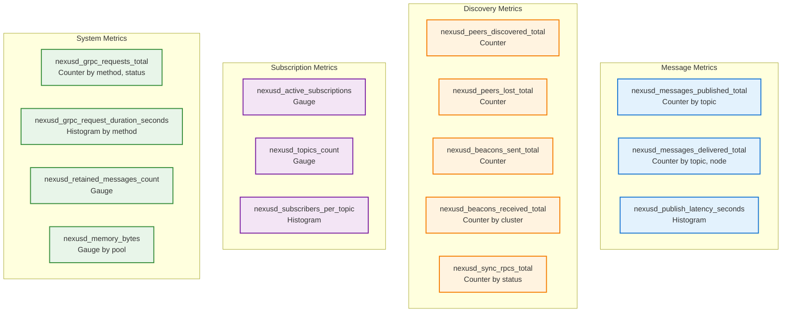
```mermaid
graph TD
    subgraph "Message Metrics"
        M1[nexusd_messages_published_total<br/>Counter by topic]
        M2[nexusd_messages_delivered_total<br/>Counter by topic, node]
        M3[nexusd_publish_latency_seconds<br/>Histogram]
    end
    
    subgraph "Discovery Metrics"
        D1[nexusd_peers_discovered_total<br/>Counter]
        D2[nexusd_peers_lost_total<br/>Counter]
        D3[nexusd_beacons_sent_total<br/>Counter]
        D4[nexusd_beacons_received_total<br/>Counter by cluster]
        D5[nexusd_sync_rpcs_total<br/>Counter by status]
    end
    
    subgraph "Subscription Metrics"
        S1[nexusd_active_subscriptions<br/>Gauge]
        S2[nexusd_topics_count<br/>Gauge]
        S3[nexusd_subscribers_per_topic<br/>Histogram]
    end
    
    subgraph "System Metrics"
        SYS1[nexusd_grpc_requests_total<br/>Counter by method, status]
        SYS2[nexusd_grpc_request_duration_seconds<br/>Histogram by method]
        SYS3[nexusd_retained_messages_count<br/>Gauge]
        SYS4[nexusd_memory_bytes<br/>Gauge by pool]
    end
    
    classDef message fill:#e3f2fd,stroke:#1976d2,stroke-width:2px
    classDef discovery fill:#fff3e0,stroke:#f57c00,stroke-width:2px
    classDef subscription fill:#f3e5f5,stroke:#7b1fa2,stroke-width:2px
    classDef system fill:#e8f5e9,stroke:#388e3c,stroke-width:2px
    
    class M1,M2,M3 message
    class D1,D2,D3,D4,D5 discovery
    class S1,S2,S3 subscription
    class SYS1,SYS2,SYS3,SYS4 system
```

### Logging

**Log Levels and Usage**:

| Level | Usage | Example | Performance Impact |
|-------|-------|---------|-------------------|
| **TRACE** | Function entry/exit, detailed state dumps | `LOG_TRACE("PeerRegistry", "upsertPeer: uuid={}", uuid)` | High CPU (10-20% overhead) |
| **DEBUG** | Important state changes, RPC details | `LOG_DEBUG("Discovery", "Hash mismatch: old={}, new={}", old, new)` | Medium CPU (5% overhead) |
| **INFO** | Lifecycle events, peer changes | `LOG_INFO("Daemon", "Peer discovered: {} at {}", uuid, endpoint)` | Low CPU (1% overhead) |
| **WARN** | Recoverable errors, degraded state | `LOG_WARN("MeshClient", "GetNodeState timeout for {}", peer)` | Negligible |
| **ERROR** | Operation failures, data loss | `LOG_ERROR("SidecarService", "Failed to deliver message {}", msg_id)` | Negligible |
| **FATAL** | Unrecoverable errors, process exit | `LOG_FATAL("Daemon", "Failed to bind port {}", port); exit(1);` | Process exits |

**Log Output Examples**:

```
[2024-12-08 14:23:01.234] [INFO] [Daemon] NexusD starting...
[2024-12-08 14:23:01.235] [INFO] [Daemon] Instance UUID: 550e8400-e29b-41d4-a716-446655440000
[2024-12-08 14:23:01.236] [INFO] [Daemon] Cluster: prod-orders
[2024-12-08 14:23:01.450] [INFO] [Discovery] Agent started on 239.255.42.1:5670
[2024-12-08 14:23:01.451] [INFO] [MeshService] gRPC server listening on 0.0.0.0:5671
[2024-12-08 14:23:01.452] [INFO] [SidecarService] gRPC server listening on 127.0.0.1:5672
[2024-12-08 14:23:02.123] [INFO] [PeerRegistry] New peer discovered: 660e8400-... at 192.168.1.11:5671
[2024-12-08 14:23:02.124] [DEBUG] [Discovery] Hash mismatch: old=0x0, new=0x1234ABCD
[2024-12-08 14:23:02.125] [DEBUG] [MeshClient] Calling GetNodeState on 192.168.1.11:5671
[2024-12-08 14:23:02.130] [DEBUG] [PeerRegistry] Updated routing: orders → {192.168.1.11:5671}
[2024-12-08 14:23:05.678] [WARN] [Discovery] Stale peer removed: 660e8400-... (last seen 7s ago)
```

**Structured Logging** (Future Enhancement):

```json
{
  "timestamp": "2024-12-08T14:23:02.123Z",
  "level": "INFO",
  "component": "PeerRegistry",
  "message": "New peer discovered",
  "peer_uuid": "660e8400-e29b-41d4-a716-446655440001",
  "peer_endpoint": "192.168.1.11:5671",
  "cluster_id": "prod-orders"
}
```

### Tracing (Future: OpenTelemetry)

**Planned Trace Spans** (See ROADMAP.md Phase 2):

```mermaid
gantt
    title Distributed Trace Example: Publish with Remote Forwarding
    dateFormat X
    axisFormat %L
    
    section App → Sidecar
    gRPC Publish call           :0, 50
    
    section SidecarService
    PublishReactor.OnDone       :50, 100
    Lookup subscribers          :100, 150
    Local delivery              :150, 200
    
    section MeshClient
    pushMessage queued          :200, 220
    gRPC call to remote         :220, 320
    
    section Remote MeshService
    PushMessage received        :320, 350
    Deliver to remote subs      :350, 400
    
    section Response
    Ack received                :400, 420
    PublishResponse sent        :420, 450
```

**Trace Attributes**:

- `nexusd.instance_uuid`: Originating node UUID
- `nexusd.cluster_id`: Cluster identifier
- `nexusd.message_id`: Message UUID for correlation
- `nexusd.topic`: Topic name
- `nexusd.subscriber_count`: Number of subscribers
- `grpc.method`: gRPC method name
- `grpc.status_code`: gRPC status code

## Security Considerations

### Current State (v1.0)

**⚠️ WARNING**: NexusD v1.0 has **NO authentication, authorization, or encryption**. Suitable only for **trusted networks**.

| Attack Vector | Risk Level | Mitigation (v1.0) | Planned (v2.0) |
|---------------|------------|-------------------|----------------|
| **Eavesdropping** | High | None - plaintext gRPC | TLS 1.3 for MeshService, mTLS for SidecarService |
| **Message Tampering** | High | None - no integrity checks | mTLS with certificate pinning |
| **Rogue Nodes** | High | None - any node can join cluster | Certificate-based authentication |
| **Topic Hijacking** | Medium | None - no authorization | ACLs: publisher/subscriber permissions per topic |
| **DoS via Beacon Flood** | Medium | None | Rate limiting, IP whitelisting |
| **Resource Exhaustion** | Medium | None | Per-client quotas, max subscriptions |
| **Retained Message Poisoning** | Medium | Trust all publishers | Signed messages (future) |

**Network Isolation Requirements** (v1.0):

1. **Deploy in private VPC/VLAN**: Do not expose to public internet
2. **Firewall Rules**:
   - UDP 5670: Allow only from cluster nodes
   - TCP 5671 (Mesh): Allow only from cluster nodes
   - TCP 5672 (Sidecar): Bind to 127.0.0.1 (localhost only)
3. **Kubernetes NetworkPolicies**: Restrict pod-to-pod communication
4. **Cluster ID as Weak Partition**: Use different `--cluster` IDs to prevent accidental cross-cluster communication

### Future Security Features (ROADMAP.md Phase 3)

```mermaid
graph TD
    subgraph "Phase 3: Security - Q3 2025"
        TLS[TLS 1.3 for MeshService<br/>- X.509 certificates<br/>- Automatic cert rotation]
        MTLS[mTLS for SidecarService<br/>- Client certificates<br/>- Certificate pinning]
        ACL[Topic ACLs<br/>- Publisher whitelist<br/>- Subscriber whitelist<br/>- Pattern matching]
        RATE[Rate Limiting<br/>- Per-client publish rate<br/>- Max subscriptions<br/>- Beacon flood protection]
        AUDIT[Audit Logging<br/>- Publish events<br/>- Subscribe events<br/>- Access denials]
    end
    
    TLS --> MTLS
    MTLS --> ACL
    ACL --> RATE
    RATE --> AUDIT
    
    classDef security fill:#ffebee,stroke:#c62828,stroke-width:3px
    class TLS,MTLS,ACL,RATE,AUDIT security
```

**Example ACL Configuration** (Future):

```yaml
topics:
  - pattern: "orders.*"
    publishers: ["service-a", "service-b"]
    subscribers: ["service-c", "analytics"]
  - pattern: "metrics.*"
    publishers: ["*"]  # Anyone can publish
    subscribers: ["prometheus"]
```

## Deployment Patterns

### Sidecar Pattern (Recommended)

```mermaid
graph LR
    subgraph "Pod 1"
        APP1[Application Container<br/>Port: 8080]
        NEXUSD1[NexusD Sidecar<br/>App Port: 5672<br/>Mesh Port: 5671]
        APP1 -.gRPC 127.0.0.1:5672.-> NEXUSD1
    end
    
    subgraph "Pod 2"
        APP2[Application Container<br/>Port: 8080]
        NEXUSD2[NexusD Sidecar<br/>App Port: 5672<br/>Mesh Port: 5671]
        APP2 -.gRPC 127.0.0.1:5672.-> NEXUSD2
    end
    
    subgraph "Pod 3"
        APP3[Application Container<br/>Port: 8080]
        NEXUSD3[NexusD Sidecar<br/>App Port: 5672<br/>Mesh Port: 5671]
        APP3 -.gRPC 127.0.0.1:5672.-> NEXUSD3
    end
    
    NEXUSD1 <-.Mesh gRPC.-> NEXUSD2
    NEXUSD2 <-.Mesh gRPC.-> NEXUSD3
    NEXUSD3 <-.Mesh gRPC.-> NEXUSD1
    
    NEXUSD1 -.UDP Multicast<br/>239.255.42.1:5670.-> MCAST[Multicast Network]
    NEXUSD2 -.UDP Multicast.-> MCAST
    NEXUSD3 -.UDP Multicast.-> MCAST
    
    classDef app fill:#e3f2fd,stroke:#1976d2,stroke-width:2px
    classDef sidecar fill:#fff3e0,stroke:#f57c00,stroke-width:2px
    classDef network fill:#f3e5f5,stroke:#7b1fa2,stroke-width:2px
    
    class APP1,APP2,APP3 app
    class NEXUSD1,NEXUSD2,NEXUSD3 sidecar
    class MCAST network
```

**Benefits**:
- **Isolation**: Each app has dedicated pub/sub daemon
- **Simplicity**: App connects to `localhost:5672` (no service discovery)
- **Resilience**: App failure doesn't affect mesh
- **Polyglot**: Apps in any language use same NexusD sidecar

**Kubernetes Example** (see KUBERNETES.md for full manifests):

```yaml
apiVersion: v1
kind: Pod
spec:
  containers:
  - name: app
    image: myapp:latest
    env:
    - name: NEXUSD_ENDPOINT
      value: "localhost:5672"
  - name: nexusd
    image: nexusd:1.0
    args:
    - --cluster=prod
    - --peers=nexusd-0.nexusd:5671,nexusd-1.nexusd:5671
    ports:
    - containerPort: 5671
      name: mesh
```

### Shared Daemon Pattern

```mermaid
graph LR
    APP1[App 1] -.gRPC.-> NEXUSD[NexusD Daemon<br/>Shared Service]
    APP2[App 2] -.gRPC.-> NEXUSD
    APP3[App 3] -.gRPC.-> NEXUSD
    
    NEXUSD <-.Mesh.-> PEER1[Peer Daemon 1]
    NEXUSD <-.Mesh.-> PEER2[Peer Daemon 2]
```

**When to Use**:
- Resource-constrained environments (e.g., edge devices)
- Monolithic applications with multiple modules
- Development/testing (single daemon for entire machine)

**Trade-offs**:
- **Pro**: Lower resource usage (1 daemon for N apps)
- **Con**: Failure domain (daemon crash affects all apps)
- **Con**: Resource contention (all apps share gRPC thread pool)

## Future Extensions

See **ROADMAP.md** for detailed implementation plans. Key highlights:

### Phase 1: Cloud-Native Discovery (Q1 2025)

- Kubernetes API-based discovery (Pod list instead of UDP multicast)
- DNS-based discovery with SRV records
- Consul/etcd integration for service registry
- `--peer-retry-count` and `--peer-retry-interval` flags

### Phase 2: Observability (Q2 2025)

- Prometheus metrics endpoint (`/metrics` on port 9090)
- OpenTelemetry distributed tracing
- Structured JSON logging with correlation IDs
- Health check endpoints (`/health`, `/ready`)

### Phase 3: Security (Q3 2025)

- TLS 1.3 for MeshService
- mTLS for SidecarService
- Topic-level ACLs (publisher/subscriber whitelists)
- Rate limiting and DoS protection

### Phase 4: Reliability (Q4 2025)

- At-least-once delivery guarantees
- Message deduplication cache
- Persistent WAL for retained messages
- Circuit breakers for failing peers

### Phase 5: Performance (Q1 2026)

- Zero-copy message forwarding
- Batch GetNodeState RPCs
- Topic wildcard subscriptions (e.g., `orders.*`)
- Compression for large messages

### Phase 6: Operations (Q2 2026)

- Helm charts for Kubernetes
- Grafana dashboards
- Terraform modules for AWS/GCP/Azure
- Admin CLI tool for cluster management

### Phase 7: Advanced Features (Q3 2026+)

- Priority queues (high/normal/low)
- Message TTL and expiration
- Request-response patterns (RPC over pub/sub)
- Dead letter queues for failed deliveries

---

## Glossary

| Term | Definition |
|------|------------|
| **Beacon** | UDP multicast message (1Hz) announcing node presence and topic hash |
| **Brokerless** | No central message broker; all nodes are peers in mesh topology |
| **Cluster ID** | Partition key allowing multiple isolated meshes on same network |
| **CRC64** | 64-bit cyclic redundancy check hash (ECMA-182) for topic state |
| **gRPC Reactor** | Async callback pattern for non-blocking RPC handling |
| **Hash-Triggered Sync** | Lazy synchronization: only transfer state when CRC64 hash differs |
| **Mesh Network** | Peer-to-peer topology where every node can route messages |
| **Retained Message** | Last message on topic, stored and delivered to late subscribers |
| **Routing Table** | Map of topic → set of subscriber node endpoints |
| **Sidecar Pattern** | Each app runs with co-located NexusD daemon (localhost communication) |
| **Subscription Stream** | Long-lived gRPC streaming RPC delivering messages to subscriber |
| **Topic State Hash** | CRC64 of sorted topic list, used to detect routing table changes |

## References

- **gRPC Documentation**: https://grpc.io/docs/
- **Protocol Buffers**: https://protobuf.dev/
- **UDP Multicast**: RFC 1112, RFC 2365 (organization-local scope 239.0.0.0/8)
- **CRC64 ECMA-182**: ISO 3309, polynomial 0x42F0E1EBA9EA3693
- **Kubernetes Networking**: https://kubernetes.io/docs/concepts/services-networking/
- **NexusD GitHub**: https://github.com/yourusername/NexusD (replace with actual URL)
- **ROADMAP.md**: Production feature roadmap (7 phases)
- **USE_CASES.md**: Real-world deployment examples
- **DOCKER.md**: Docker containerization guide
- **KUBERNETES.md**: Kubernetes deployment guide with UDP multicast workarounds

---

**Document Version**: 2.0  
**Last Updated**: 2024-12-08  
**Maintainer**: NexusD Contributors
